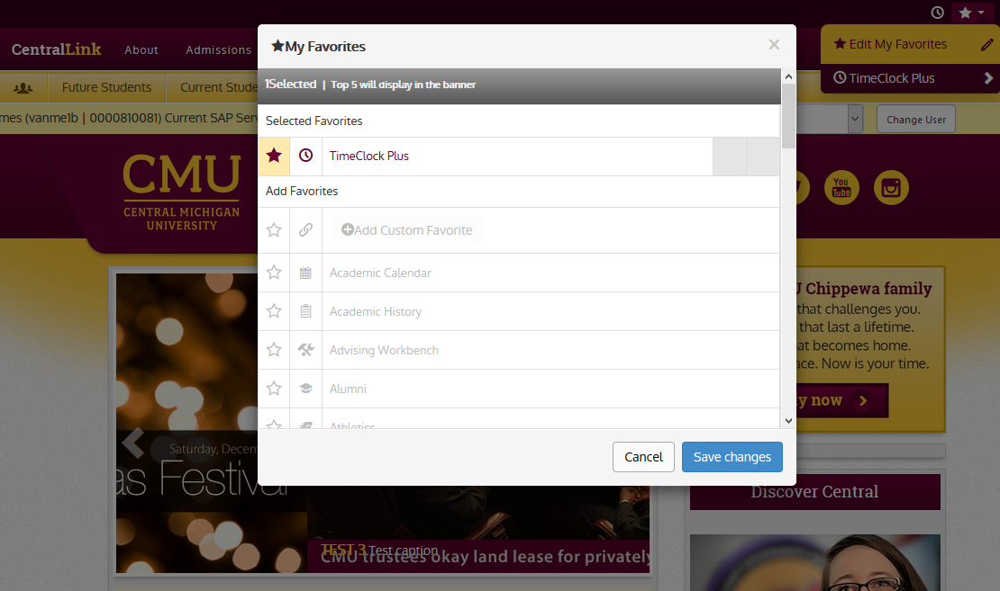
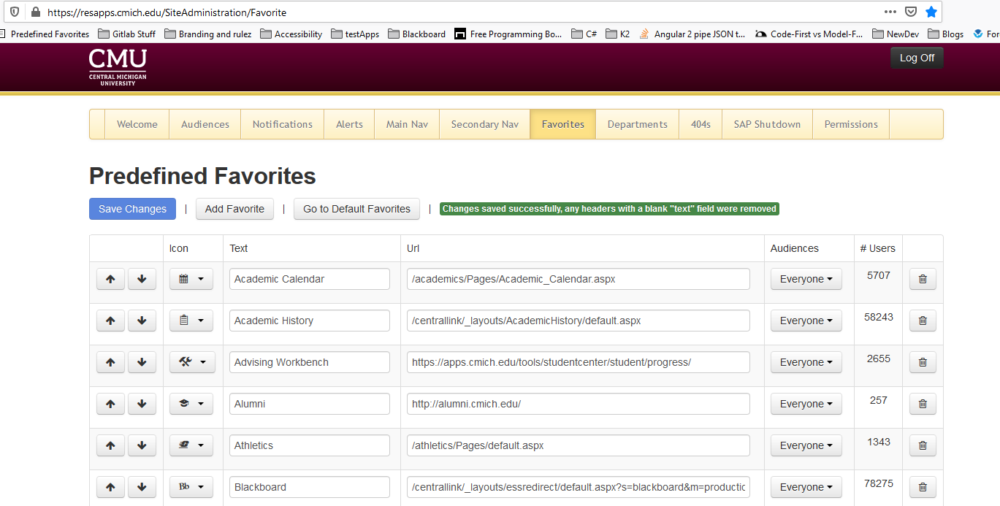

The SharePoint based cmich.edu site has a custom made site header bar which contains, among other things, per-user customizable hyperlinks. This has benefits over browser bookmarks/favs. Say for example a web application moves to a different URL. We can just update the URL in one place, and users will not have to do anything.

The not so fun part of this, is when we have to add new "Pre-defined" links, and there's no applicable icon to choose from. We'll use the example of when we switched to TimeClock Plus (the reason for this Wiki page). There was a request make 2 links in the site header available for both regular and supervisor use. 

To add pre-defined links, you use the [Site Administration](https://resapps.cmich.edu/SiteAdministration/Favorite) app. If you click this link, you'll find that you don't have access to anything it does. You'll need to give yourself permission by adding a row in `it-webtestln` -> `Databases` -> `SiteHeaderDetails` -> `tables` -> `dbo.GroupMembership` with your GUID. 

For starters, the site header bar uses the CMich icon pack. Of course for our needs, the cmich_icons.css file lacked any clocks, so first those had to be added. That lead to the creation of the [how to add to cmich icons](how-to-add-to-cmich-icons) Wiki page. You'll need to follow along with that guide and come back to this once the new icon(s) are available on the CDN.

Next, it's time to update the list of available icons to choose from. In the same database where you added the group membership, there are two tables of interest: 
*  `cmichFavoriteIcons` - a ClassName lookup table
*  `Icons` - you'll need to add IconId, Class, and Description

Once this is done, the new icon(s) will be available.  In Site Administration's Favorites editor, simply add the pre-defined link.

## Tags
[[Favorites]](https://code.cmich.edu/search?project_id=365&repository_ref=master&scope=wiki_blobs&search=FavoritesTag)
[[Site Administration]](https://code.cmich.edu/search?project_id=365&repository_ref=master&scope=wiki_blobs&search=SiteAdministrationTag)