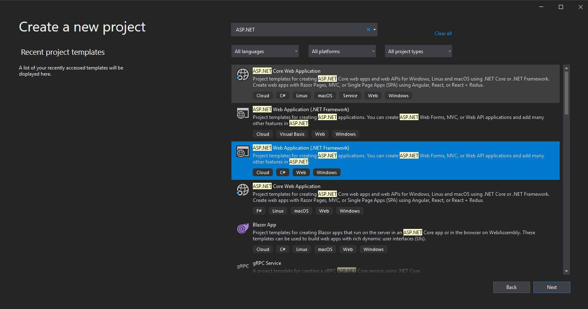

## Understanding and Using Angular  

### Introduction to Angular 

This is the final official training before being able to work on tickets. Angular is Typescript-based web application framework from [Google](https://en.wikipedia.org/wiki/Angular_(web_framework)). 

### Outcome(s)

* Gain the ability to use Angular 
* Understand and use ASP.Net API 

### Training Material

* [Tour of Heroes](https://angular.io/tutorial) 

## Assignment 1 

You will go through the “Tour of Heroes”. Tour of Heroes is a step by step guide to help create an application using Angular. In the link above, complete the guide and then continue to your second assignment. *TIP: If you are struggling to get the commands to work for angular use the “Node.js command prompt” instead of the original command prompt.*

## Assignment 2 

This assignment is similar to Assignment 2 for C#. Take your Assignment 1 from C# and have it run through Angular. Open Visual Studios and create a new project. Select “ASP.NET Web Application” 

Now you can begin your Angular application. Good Luck! *TIP: When creating a controller, try using API instead of MVC.*
