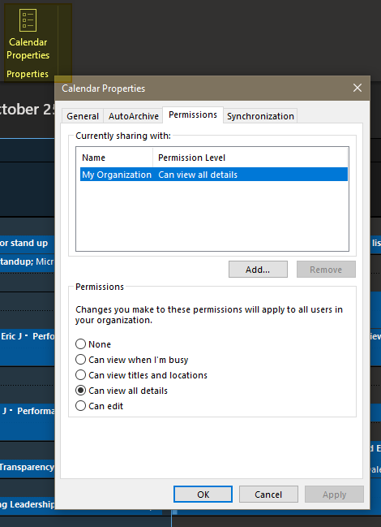
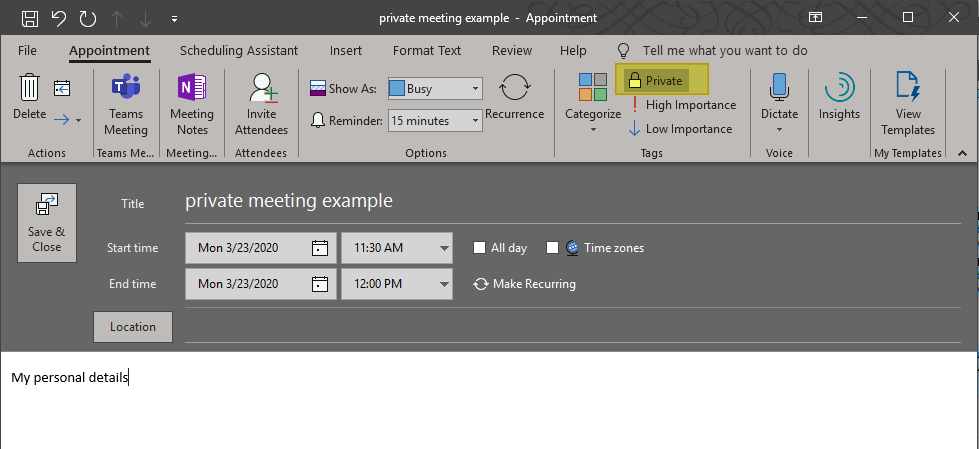
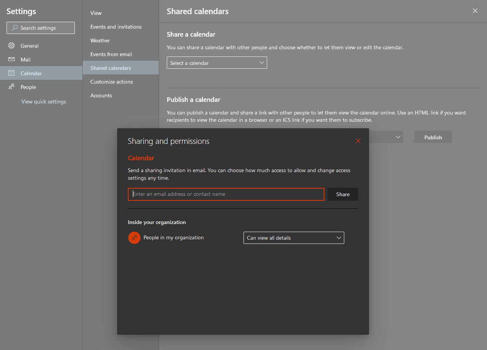
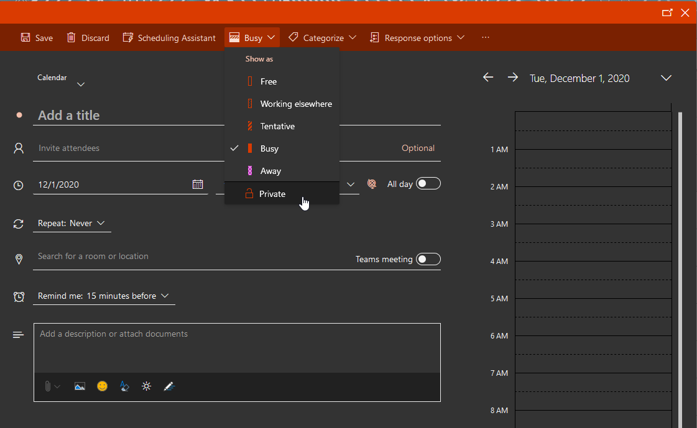

The Application Development team aims for transparency within our team and with those we serve. For this reason, you are expected to share your work calendar with the organization. If you need to setup a private appointment to protect your privacy you may use the Private Appointment feature.

## Outlook for Windows
1. Click **Folder** in the Ribbon Menu
1. Click **Calendar Properties**
1. In the Calendar Properties select the **Permissions Tab**
1. Select the **My Organization** under Name near the top
1. Change the **Permissions** to `Can view all details`
1. Click **OK** at the bottom

### Private Calendar Items

## Outlook for Web
1. On the top-right click the **Settings** Gear Icon: 
1. Then select **View all Outlook Settings** at the bottom of the menu
1. In the model popup make sure **Calendar** is selected in the left menu and then select the submenu item **Shared Calendars**
1. Under the `Share a Calendar` heading select your main calendar typically titled `Calendar` and a `Sharing and Permissions` modal will appear
1. Change the permission dropdown under `Inside your organization` to `Can view all details`

### Private Calendar Items

## Tags
[[Office365]](https://code.cmich.edu/search?project_id=365&repository_ref=master&scope=wiki_blobs&search=Office365Tag)
[[Policy]](https://code.cmich.edu/search?project_id=365&repository_ref=master&scope=wiki_blobs&search=PolicyTag)
[[Email]](https://code.cmich.edu/search?project_id=365&repository_ref=master&scope=wiki_blobs&search=EmailTag)