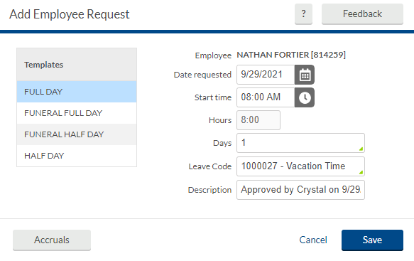
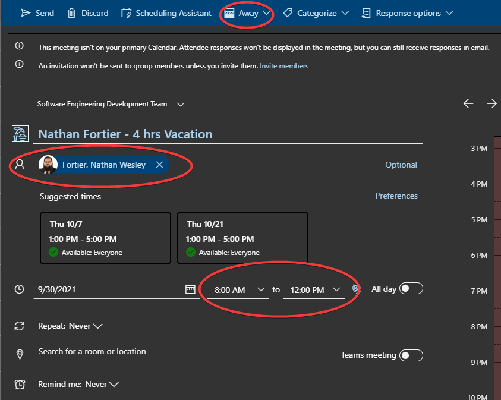
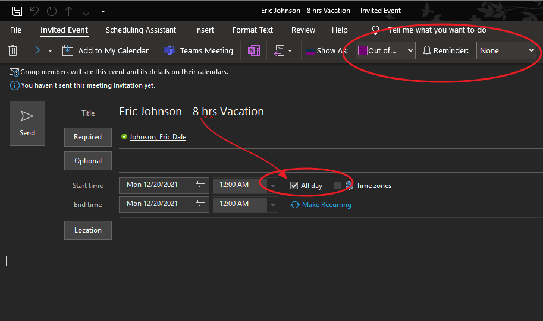

[[_TOC_]]

## Planned Absence
1.  Put in a request using [Time Clock Plus (TCP)](https://tcp.apps.cmich.edu)
    - Use the **Description** field to provide approval if on a project team
      - Example: Approved by Crystal on 9/29/21   
        > 
1.  Upon receipt of approval email
    - Update the `Software Engineering Development Team` Outlook calendar by adding a new event and inviting only yourself
      > ℹ You SHOULD NOT invite the team, as we can all reference this calendar if we we want to. Just ignore Outlook saying "An invitation won't be sent ..." as shown here 
      - You will need to enable the `Software Engineering Development Team` calendar on the left panel by selecting it from the group calendar menu
        > ❗ `All Day` events are preferred when you are taking off the whole day, but DO NOT USE `All Day` for half-days. Instead select the **Start time** and **End time** for your 4-hour block.
        - In [the browser](https://outlook.office.com/calendar/view/week) select the calendar from the drop-down when making a new event. Below is a 4-hour example.
          > 
        - In Outlook simply make a new event by right-clicking the calendar for the day of interest and select **New Meeting Request**. Below is an 8-hour example.
          > ℹ It automatically includes the `Software Engineering Development Team` group. You should **delete** the group and only invite yourself.
          >
          > 
    - Title: {NAME} – {#} hrs {TYPE}
      - Example: Eric Whitmore - 8 hrs Vacation
    - Set Date/time using the date/time selectors
      > ❗ As previously noted, use `All Day` for 8-hour/full-day scenarios **ONLY**
    - Reminder: None
    - Show As: `Away` or `Out of Office`

### Special Note for Last Two People on a Team to Request a Day Off
The general policy is that we plan to approve days off given no time-sensitive project work, with the following exceptions.
#### Last Person in The Office for Your Team
If you are the **last person** and only person scheduled to work on a particular day for your team (AppDev or SAP), you are not permitted to take the day off since we need coverage of at least a single person working that day
#### 2nd to Last Person in The Office for Your Team
If you are the **2nd to last person** scheduled to work on a particular day for your team (AppDev or SAP), you **MUST** take a laptop home _in case of emergency or the last person working that day gets sick (or their dependents)_.
**Your Options:**
- Take the laptop home in case of emergency 
- Take a different day off of work
- Take the laptop home and Work that day remotely
- Find someone else on vacation that day to take a laptop with them

## Unforeseen Absence
1.  Email or Teams Nathan Fortier and Eric Whitmore, letting them know you wont be in that day as well as the expected duration of your absence
1.  Follow the rest of the processes outlined above at your earliest convenience 

## Reminders
*  **Prior to leaving:** Setup an automatic reply
*  **Prior to leaving:** Email team reminding them that you will be unavailable
*  **Upon return:** Update TDX with time off
*  **Upon return:** Disable automatic reply

## Tags
[[Policy]](https://code.cmich.edu/search?project_id=365&repository_ref=master&scope=wiki_blobs&search=PolicyTag)
[[Email]](https://code.cmich.edu/search?project_id=365&repository_ref=master&scope=wiki_blobs&search=EmailTag)