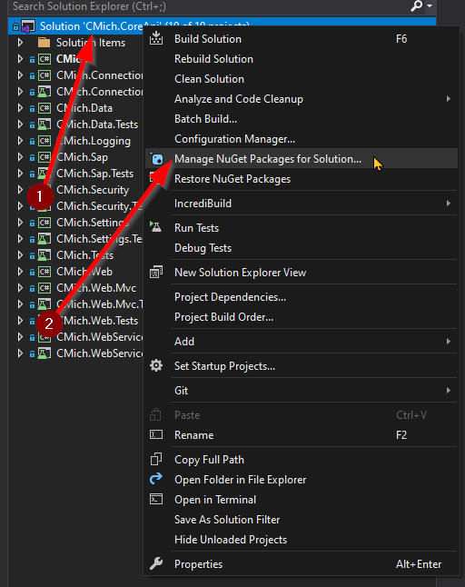
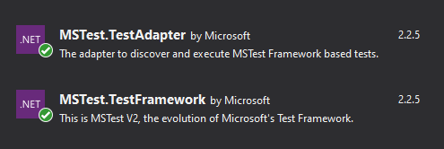
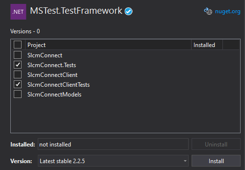
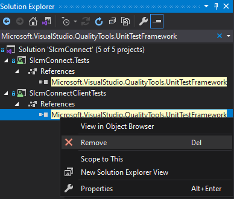

# How To Update Your Solution and GitLab .yml file to use the Visual Studio 2019 MSTest
As of July 2021, the MSTest packages and scripts will require some updates to successfully build in Visual Studio 2019. Below are some steps that should be done to every application using testing (which should be all of them). In Gitlab the VS2019 Build Tools have been installed and a **system variable** of `%VSCOMNTOOLS%` has been added to reference its location path.

## Upgrade NuGet Packages
### Adding New NuGet Packages
Make sure your MSTest NuGet packages are up to date **and compatible with the solution**. `MSTest.TestAdapter` and `MSTest.TestFramework` should be updated to 2.2.5 for all projects. There are a variety of ways to do this, but perhaps the simplest is through the Package Manager.
1. Right-click the solution
1. Select "Manage NuGet Packages for Solution"

     
1. Search for and select the desired package (`MSTest.TestAdapter`/`MSTest.TestFramework`)

     
1. In the version dropdown, select 2.2.5, check all projects that are used for testing, and finally select "install"

   

### Removing Old NuGet Packages
`Microsoft.VisualStudio.QualityTools.UnitTestFramework` is no longer supported and should be removed from any projects in the solution. This can be done by searching in the Solution Explorer for "Microsoft.VisualStudio.QualityTools.UnitTestFramework", right-clicking the reference, and selecting "Remove".

## Update Build Scripts
The build scripts will also need to be altered in the .gitlab-ci.yml file which can be located in the "Solution Items" folder.
The first change is to the before_script:
- `'call "%VS140COMNTOOLS%\vsvars32.bat"'`  # OLD 
- `'call "%VSCOMNTOOLS%\VsDevCmd.bat"'` # NEW

The Test Runners will also need some work:

Without filters:
- `mstest /testcontainer:ITSMConnect.Tests\bin\Test\ITSMConnect.Tests.dll` # OLD
- `vstest.console.exe ITSMConnect.Tests\bin\Test\ITSMConnect.Tests.dll /Logger:trx` # NEW

With filters:
- `mstest /testcontainer:ITSMConnect.Tests\bin\Test\ITSMConnect.Tests.dll /test:Unit` # OLD
- `vstest.console.exe ITSMConnect.Tests\bin\Test\ITSMConnect.Tests.dll /Logger:trx /TestCaseFilter:"TestCategory=Unit"` # NEW

Note: While MSBuild isn’t changing, MSTest is. MSTest is now considered legacy by Microsoft and has been replaced by `vstest.console.exe`. This is the same program used by VS2019 and includes MSTest and other runner functionality. 

## Final Cleanup
> ⚠ After upgrading the NuGet packages and build scripts, it is important to do a clean build on the solution and check for any errors or warnings in the console.

## Tags
[[.NET]](https://code.cmich.edu/search?project_id=365&repository_ref=master&scope=wiki_blobs&search=DotNETTag)
[[Deployment]](https://code.cmich.edu/search?project_id=365&repository_ref=master&scope=wiki_blobs&search=DeploymentTag)
[[NuGet]](https://code.cmich.edu/search?project_id=365&repository_ref=master&scope=wiki_blobs&search=NuGetTag)