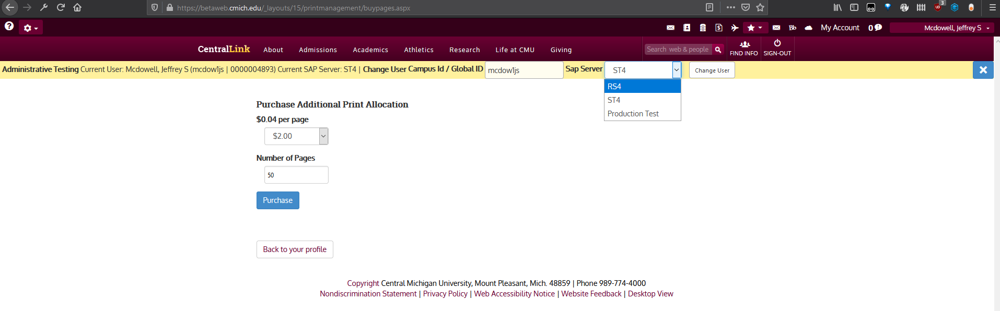

# The **Administrative Testing** Bar in SharePoint Applications
SharePoint has an [**Administrative Testing** bar](https://code.cmich.edu/IT-AppDevelopment/SharePoint/Misc/CMich.SP.Ctrl.SiteHeader/-/blob/master/CMich.SP.Ctrl.SiteHeader/ControlTemplates/CMich.SP.Ctrl.SiteHeader/TestingInformation.ascx.cs) that in non-production environments allows you to Impersonate a different user, and to toggle between SAP Backends (DV4/RS4, ST4 and Production Test). This is especially useful to testing custom application embedded in SharePoint like [PrintManagement](https://code.cmich.edu/IT-AppDevelopment/SharePoint/WebParts/CMich.SP.WP.PrintManagement).



## How To add permissions to allow someone to see the **Administrative Testing** Bar 

1. Select the correct server for the environment you wish to give permissions from this table:

   | Environment | Database Server |
   | ------ | ------ |
   | https://betaweb.cmich.edu |  `it-db2k12dev01`|
   | https://stgweb.cmich.edu | `it-webtestln`|
1. Run  `SELECT [Value] FROM [PortalApplicationConfig].[dbo].[Settings] WHERE setting = 'AdminTesters'`
1. Use the results from the above step and add the globalId of the new user to the end of the results with a semi colon at the end
   - e.g., add `hughe1jr;` to peles1j;taylo5kl;mull1mm;bridg2bb;johns7ed;westr2l;vanme1b;maill1s;**hughe1jr;**
1. Update the globalID list with the new user by running the following SQL 
   - *(Note: be sure to add WHERE clause or you will wipe out all other `Value`s)*

   ```sql
   UPDATE [PortalApplicationConfig].[dbo].[Settings]
   SET Value = 'peles1j;it-hughe1jr;it-mcdow1js;it-jacks3m;it-abbot1a;it-schal1r;it-daugh1tj;it-mcgil1ra;taylo5kl;mull1mm;johns7ed;westr2l;vanme1b;maill1s;{NewGlobalIdHere};'
   WHERE setting = 'AdminTesters' -- be sure to include this WHERE clause
   ```

## Tags
[[SharePoint]](https://code.cmich.edu/search?project_id=365&repository_ref=master&scope=wiki_blobs&search=SharePointTag)