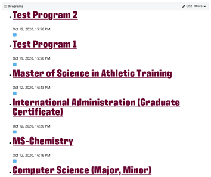

# Customizing Sitefinity Widgets
Below are instruction on how to customize a Sitefinity Widget and how is shows, and what is shows for its "Design View" (i.e., it's options view for editors to change settings).

## Creating a new dynamic module

Like custom lists in SharePoint, dynamic modules in Sitefinity are used to make widgets that are driven by custom fields of various data types. To create a dynamic module in Sitefinity, you can go to the module builder, create a new module and just add whatever fields you need.

## Getting the new module to show in the toolbox

When creating a module, it is not necessary to create a specific controller except if we want to change the default behavior. What we must do is create a folder (Bootstrap4/MVC/Views) with the name of the entity (singular) and add the specific views (at least List or Detail since a module inherits from a list). This is an example with alerts:

 Once the views are added to the folder, the new module will be displayed in the toolbox under a new section with the name of the module (plural).

### Streamlining the auto generated widget designer

Once a widget appears in the toolbox based on your new dynamic module, it will do so using the default widget designer and views from the [Feather Project](https://github.com/Sitefinity/feather-widgets). When you first drop your widget on a page, it will show the List view, looking something like this:

 Most likely, this is far from what you want, especially if the idea is to only show one list item in the widget, the last thing you want is to show the list view.

#### Default Dynamic Module view components

To take a step back, let us first consider what is generated when we make a new widget based on a dynamic module. It consists of the following files, found in the folder _SitefinityWebApp/ResourcePackages/Bootstrap4/MVC/Views:_

- `DesignerView.Simple.cshtml`: This is the widget designer itself. It&#39;s what you see when you click the edit button on the widget, and will contain three tabs full of settings:
  - Content – Gives options of what list items to show

    

  - List Settings: additional configuration of the listing views

    

  - Single Item Settings: additional configuration for displaying a single list item

    

> ℹ Note: The below files are to be located in _SitefinityWebApp/ResourcePackages/Bootstrap4/MVC/Views/{Your module name}._ unless otherwise specified.
- `DesignerView.Simple.json`: This file is used to specify which components and scripts the widget designer should use. This file is used if you need to override the default Angular JS file. 
- `designerview-simple.js`: The default angular JS file that drives the designer view is not in the Views folder. Instead you'll have to create a folder in the _SitefinityWebApp/ResourcePackages/Bootstrap4/MVC/Scripts/_ like, _ResourcePackages/Bootstrap4/MVC/Scripts/{Your module name}._ After this, you can override the out-of-the-box Javascript behind the widget designer.
- `List.{your module name}.cshtml`: This will be the default view for your dynamic module. It can be very useful to override this for any widgets that are intended to only show a single item and have the list view just show a notice that the content editor needs to select a list item.
- `Detail.{your module name}.cshtml`: This will be the default single item view for your module.

Note that the starting point for any of these will be to go to the Github repository for the Feather project and use the default dynamic module MVC files for all the above, renaming them to match your module name.

Feather Project dynamic module MVC link: [https://github.com/Sitefinity/feather-widgets/tree/master/Telerik.Sitefinity.Frontend.DynamicContent/Mvc](https://github.com/Sitefinity/feather-widgets/tree/master/Telerik.Sitefinity.Frontend.DynamicContent/Mvc)

For a simple example of all of this in action, take a look at the department widget in _SitefinityWebApp/ResourcePackages/Bootstrap4/MVC/Views/Department_, which is just a simple widget to show department contact info in the sidebar.

## Tags
[[Sitefinity]](https://code.cmich.edu/search?project_id=365&repository_ref=master&scope=wiki_blobs&search=SitefinityTag)