# Sitefinity Website Deployment

Our Sitefinity based version of cmich.edu is deployed through pipelines in Azure DevOps. All development is done locally on independent Git branches based off the master branch, which is great coming from our SharePoint 2013 environment.

There are three tiers of deployment:

- Dev: This is the first place where code in the master branch gets pushed. It&#39;s the focal point for testing.
- Staging: This is where the pages are built by UComm Strategists and collaborators from the various colleges and CMU entities. Think of it as a proving ground for content and code intended for production.
- Production: As of the time of this writing, we are not there yet

## Working in local development environment

When working in your local development, you&#39;ll have you&#39;ll usually be doing one of two things:

- Bugfixes – in this case, you&#39;ll prefix your branch name with &quot;bugFixes/&quot; followed by the bug number in Azure DevOps
- New Features – new feature branches are prefixed with &quot;features/&quot; followed by the name of the feature being developed.

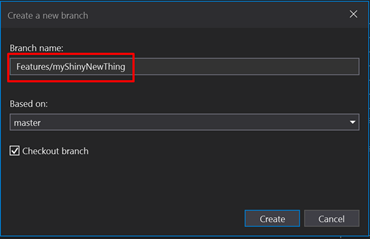

## Deploying to Dev Server

Deploying to the dev server is just a matter of merging your branch into the master branch, but it must be done through a Pull Request (same as a Merge Request in Gitlab) and "requires" a peer review. Once completed, the deployment pipeline will run.

{TODO add screenshots}

## Deploying to Staging Server

Create a branch with the naming convention of "Releases/\{releaseNumber}". (note: `releaseNumber` should [semantically](https://semver.org/) increase)

> ❗ Before making the new Release/ branch always Pull to update your local master branch from what is on Azure

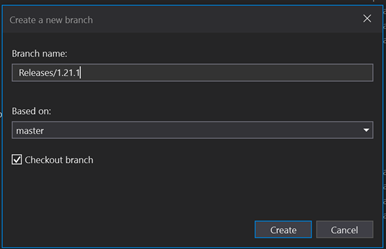

Push your new branch.

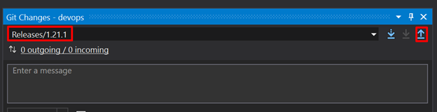

Doing so will trigger a release pipeline to run. Note that this doesn't automatically release/deploy. It simply creates artifacts to deploy.

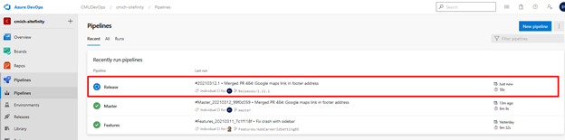

If you&#39;re impatient or just curious, you can watch the whole pipeline run by clicking the release in the pipelines page of Azure DevOps. Note the last steps in the screenshot showing the artifacts being built.

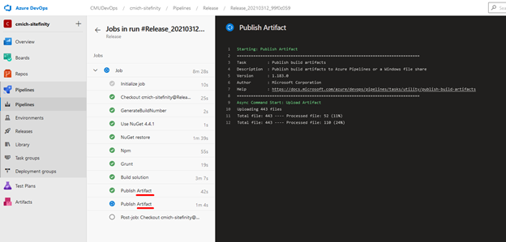

Now go to the Releases section of the pipelines menu. Click to **Create** release:

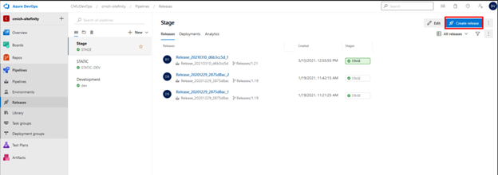

 A side bar thingy will pop out on the right showing the following. Just note the date of the chosen artifact and click create:

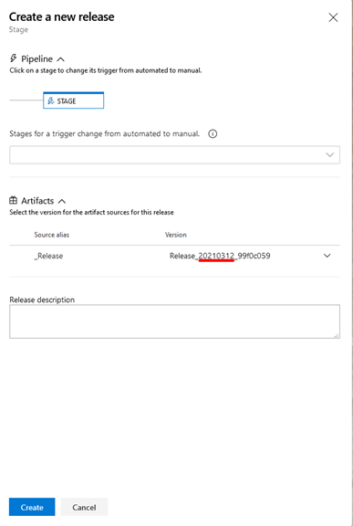

A new release will show up. Click on **Release_YYYYMMDD** heading link. Note the **Prod** pipeline is used to deploy the Release artifact to **STAGE** and/or **Prod**.

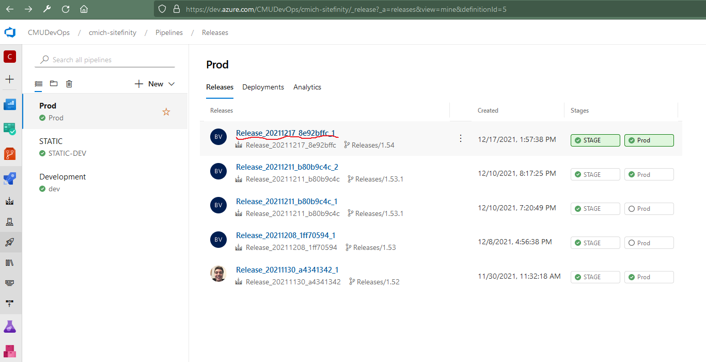

This will take you to the release process.

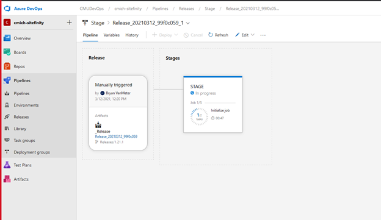

A few jobs/tasks will run, but then stop at some point with a "Resume" prompt. Click this and another side bar will pop out with one last call to as if you want to Resume or Reject.

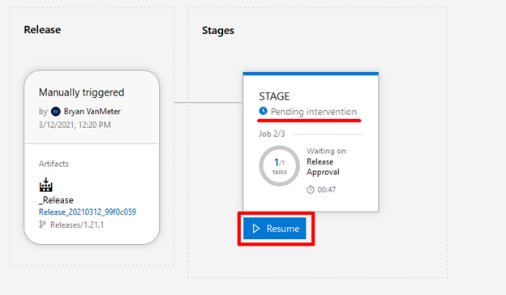

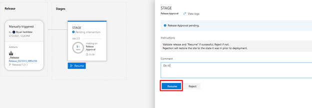

The last steps will run and hopefully the green "Succeeded" Message will appear.

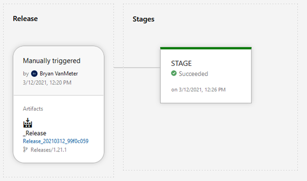

## Troubleshooting
### How to Read Logs for C# errors
If errors happen in any MVC controllers, errors are logged in _{Git project folder}\SitefinityWebApp\App\_Data\Sitefinity\Logs\filename.log._ While these are easy to access on your local dev instance, you have to go through an alternate route on the servers. You can get the logs through the [Sitefinity admin interface file manager](https://stage-www.cmich.edu/Sitefinity/Administration/Files). You'll have to download 2 or more files at a time though or you'll get an error due to windows file locks since the file you're looking for is probably the one that's currently open and being written to. Downloading 2 or more files zips them, which gets around the file locks.

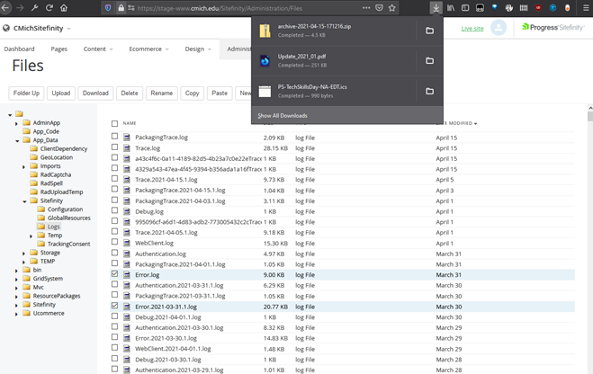

### How to have deployments delete the old files in the destination folder

- Head to Azure [Pipelines > Releases](https://dev.azure.com/CMUDevOps/cmich-sitefinity/_release)
- Select your tier, for example [Prod > Stage](https://dev.azure.com/CMUDevOps/cmich-sitefinity/_release?_a=releases&view=mine&definitionId=5).
- Click the [**✏ Edit**](https://dev.azure.com/CMUDevOps/cmich-sitefinity/_releaseDefinition?definitionId=5&_a=environments-editor-preview) button on the top right
- Click **Tasks** > **your-sub-tier**, like **STAGE**
- Under Deploy Web Apps click **Azure App Service Deploy: test-web-cmich-edu-usnc**

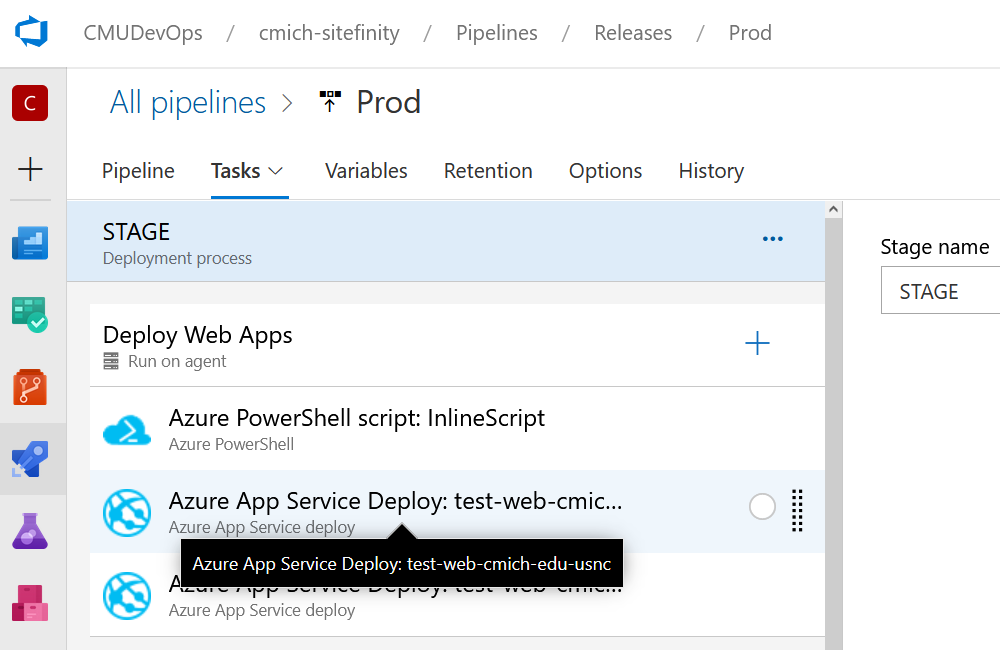

- Options should display, expand **Additional Deployment Options**
- Check the checkbox for **Remove additional files at destination**
- Click the **💾 Save** button on the top right

## Tags
[[Sitefinity]](https://code.cmich.edu/search?project_id=365&repository_ref=master&scope=wiki_blobs&search=SitefinityTag)