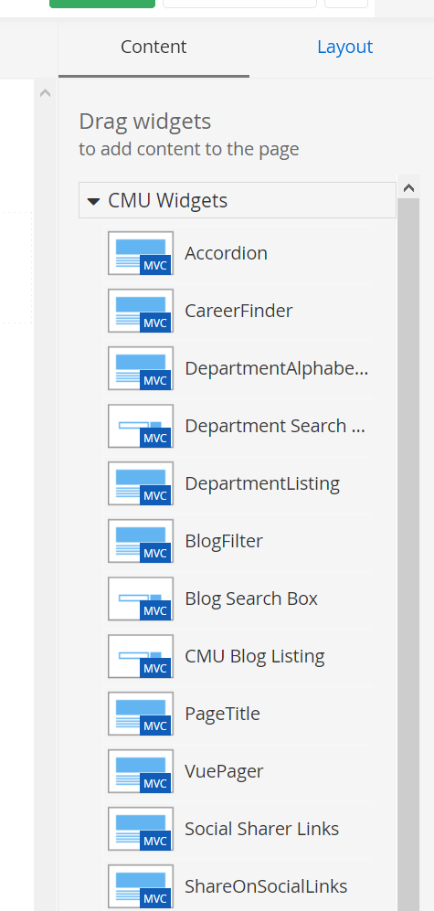
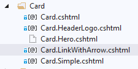
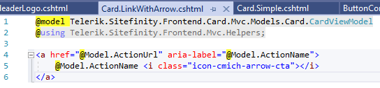
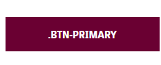
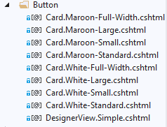
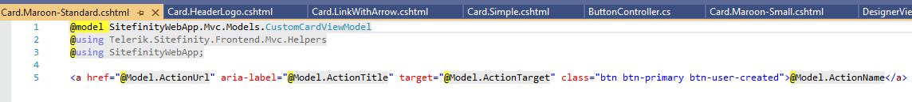
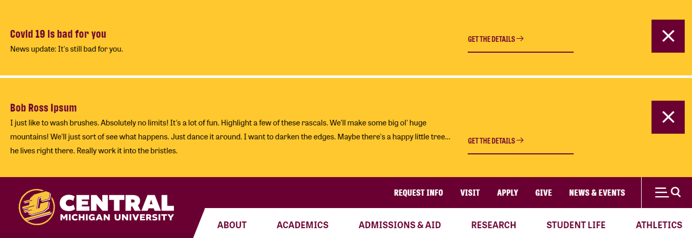
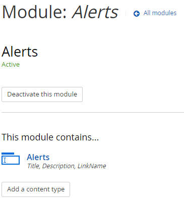
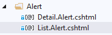
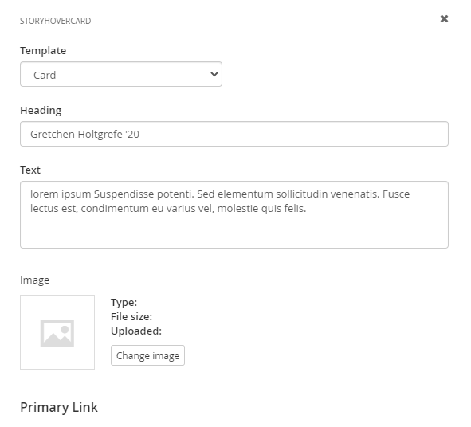

# How to Develop on Sitefinity with Best Practices and Patterns

This site contains Architectural Guidelines for back-end and front-end component creation for CMS (Content Management Systems) learned largely from [Joe Blanchette](mailto:joe.blanchette@silvertech.com) from SilverTech.

[CMichSiteFinity Playbook > Widgets](https://stage-www.cmich.edu/new-sitefinity-playbook/widgets) is an excellent resource to learn more about the use of specific widgets.

## FAQ
### What is the toolbox?
The toolbox is the list of widgets and layouts visible on the right side of a page when in edit mode.

   

### When creating a custom element, how do we decide if we need to create a **view**, **widget** or **module**?
- **View**: the element is very similar to a built-in widget (in Sitefinity) but has a different design (e.g., hard-coded colors, different format, or similar fields). To select it after creation in the Sitefinity Editor, click on the Widget's **Edit > List Setting > List Template** dropdown.
    - Example: 

       

       In the example above, we only need a link, the rest being CSS. So it is very basic. A built-in card contains fields like title, description and link, so it is much more than we need. Creating a custom view (LinkWithArrow) for a card seems to be a good solution.
       
       

         

- **Widget**: the element is very similar to a built-in widget (in Sitefinity) but has extra fields. 
    - In this case, the widget will inherit from a specific built-in widget (a card in most cases) and will use a custom model containing the extra fields. 
    - For separation purposes and have a distinct widget in the toolbar, we can also create a custom widget even if the element is strictly identical to a specific built-in widget.
    - Example:

       

       In the example above, we want to create a CMU button. We only need a link, the rest being CSS. So it is very basic. A built-in card contains fields like title, description and link, so it is much more than we need. However, for separation purposes, we would like to have a separate item in the toolbox (see [question on toolbox](Content-Management-Best-Practices-and-Patterns#what-is-the-toolbox)) and not a view of the built-in card (like explained in the "View" bullet above). So we are going to create a custom widget. The process to create a widget is explained in the [question on layouts vs. widgets](Content-Management-Best-Practices-and-Patterns#how-are-layouts-aka-sitefinity-grid-layouts-and-widgets-different-and-how-do-you-build-new-ones)

       

       

- **Module**: the element is a custom Sitefinity list (e.g., *Programs* from SAP with *Locations* within, where both tiers are lists) which is **not** based on built-in lists (e.g., News, Events, Blogs, Documents or SF Lists).
    - It will appear in the toolbox as a widget (see [question on toolbox](Content-Management-Best-Practices-and-Patterns#what-is-the-toolbox))
    - You could add multiple views, like with any widget
    - Example:

       

       In the example above, we want to create a list of alerts. The list has custom fields so we cannot use built-in widgets. We will have to create a "custom" list, this is called a **module** in Sitefinity. You can create a module from the module builder (Administration/Module builder).

       

       Once created, the module works exactly like a custom widget, except you don't need to create a controller. You just have to create the folder with the required files (default view and designer view). If you want to customized them you can add a different view or new designer view in Visual Studio.

       

### How are Layouts (aka, Sitefinity Grid Layouts) and Widgets Different, and How Do You Build New Ones?
- Sitefinity Grid Layouts are reusable HTML code. The list of grid layouts can be found under the Layout tab in edit mode. This is a grid layout for a generic content block:
```
<div class="generic-content section-padding">
    <div class="container sf_colsIn" data-sf-element="Content" data-placeholder-label="Content">

    </div>
</div>
```

In this example, we would like the code in the "container" div to be dynamic. To reach this goal, we need to add a special class "sf_colsIn" to tell Sitefinity it is a dynamic part. A dynamic part means we will be able to drop any SF widgets available in the toolbox (built-in or custom), for example a content block.

To build a new layout, create a new HTML file under **ResourcePackages/Bootstrap4/GridSystem/Templates**.

- A Sitefinity widget is a reusable component similar to a webpart in SharePoint. A widget contains dynamic fields which can be edited. The list of widgets can be found under the Content tab.

To build a custom widget:
- Create a new controller under **Mvc/Controllers**
- Create a new folder under **ResourcePackages/Bootstrap4/MVC/Views** with the same name as the controller (without the Controller suffix)
- Under this new folder you need to create at least two files: a default view and a designer view. The default view is the HTML/Razor code of the widget itself. The designer view is the HTML/Razor of the edit panel. To know the name of the default view (Card.cshtml, Index.cshtml...) we generally look at existing custom widgets inheriting from the same built-in widget. For example, if a controller inherits from CardController, the name of the view will be Card.cshtml.  

### How do you define what area the content editors can change (aka, a **dynamic area**) in Sitefinty?
- In a template layout (i.e., [Page Templates](https://stage-www.cmich.edu/Sitefinity/Design/PageTemplates)), which is the base template of an entire page, an editable area is defined by a `SfPlaceholder`.
Example: **@Html.SfPlaceHolder("Contentplaceholder1")**

- In a Grid layout, which is a reusable HTML code and which allows you to drop a widget, is an editable area defined by a `sf_colsIn` class.
Example: 
```
    <div class="container sf_colsIn" data-sf-element="Content" data-placeholder-label="Content">

    </div>
```

- In a Widget it is done with settings in the edit panel

   


### How do you define specific choices for a widget in Sitefinity for a content editor to chose from, like the choice of only 3 button sizes or 2 button colors?
When we want to have variants of a same widget, we need to create a custom view (called template in the edit panel) whether it is for a built-in or custom widget. See an example below with the button widget:


### When should we hard-code something in .cshtml files (in Visual Studio by a dev) , verse when to allow it to be editable in the CMS (by a site admin)?
If we create a page layout, grid layout or widget, it will be hard-coded in a .html (grid layout) or .cshtml code. We want the user to write the minimum of HTML in order him/her not to break things. So if we are in a case where the user has to add some custom CSS classes, it means we need to rewrite some code to prevent the user from doing that. We can include this custom CSS in a grid layout or a widget for example. 

### When should we use content creators' lists instead of dynamic content from SAP data feeds or 3rd party APIs?

All external data is actually stored in Sitefinity in modules (custom lists). A scheduled process (which run constantly) imports all data into Sitefinity (like Programs, Locations...). A module can contain extra fields which are not contained in the external source. Modules can be manually maintained by users.

### What's with the Whole Frontend Folder Thing?

The goal of Silvertech's static frontend development technique is to create markup/CSS/JS that represents the structure of various modules/layouts that will be created in Sitefinity. The static markup is used as the source of truth for responsive visual layout, W3C validation, as well as Accessibility validation, without having to worry about the CMS. This markup is then copied into cshtml (Razor) files, which represent the "View" of the MVC pattern. Doing it this way, backend developers don’t have to worry about writing much in the way of CSS or JavaScript.

### What is the file structure of the `/ST/` Silvertech code?

* ResourcePackages/ST/
    - /Frontend - Grunt task is run in this folder. 
        - /dev
            - /App – html template source files written in Nunjucks
                - /MasterPages – These represent the top-most level pages. All templates inherit from master.html except the marketing/app template.
                - /Templates – individual page layout templates.
                    - /views
                        - /layouts – widget layout containers
                        - /partials – sub-components like list items, search results, etc that are usually made by loops
                        - /shared – global components not specific to any layout
            - /ResourcePackages 
                - /ST
                    - /library
                        - /css – generated from src
                        - /fonts – just cmich_icons_2020
                        - /img – Images in the file system (not cms)
                        - /js – generated from src
                        - /src – The JS and SCSS source files
                            - /js – source files
                            - /scss - source files
        - /node_modules – self explanatory
        - /static_html – final compiled product of all grunt processes. 
    - /Library (This all gets copied by Grunt task into the static_html folder above)
        - /css – generated and vendor/plugin CSS goes here
        - /fonts – cmich icons
        - /img – Images that are on the server instead of being in the CMS. A copy of everything in 
        - /js – compiled main.js, vendor files, and other JS that doesn’t necessarily belong in main.js

It’s important to note that the backend/CMS in the local development environments pull all non-markup (JS, CSS, images, etc) from the frontend folder while production and staging pull from minified versions of what’s in the frontend folder.

## Tags
[[Sitefinity]](https://code.cmich.edu/search?project_id=365&repository_ref=master&scope=wiki_blobs&search=SitefinityTag)