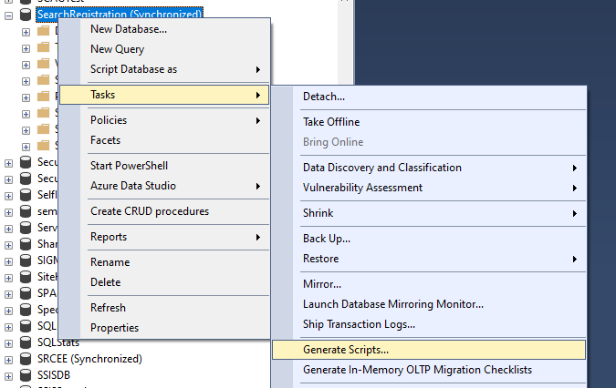
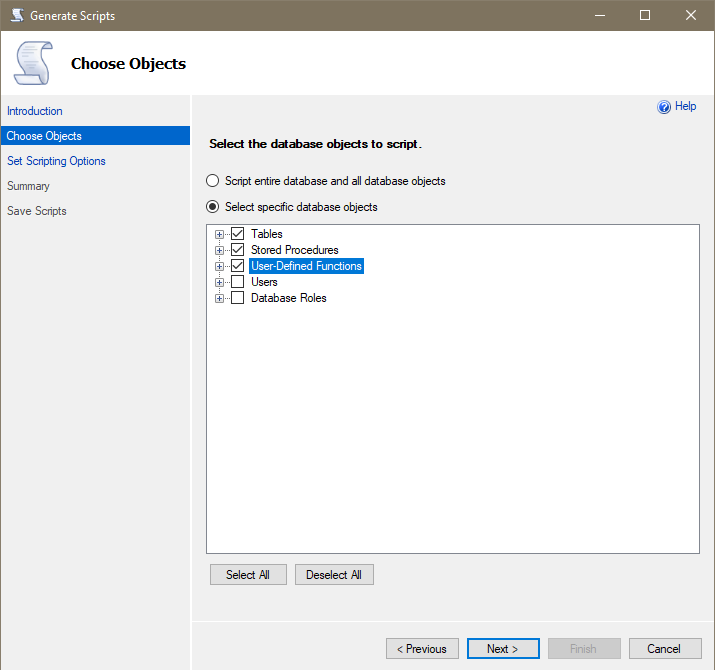
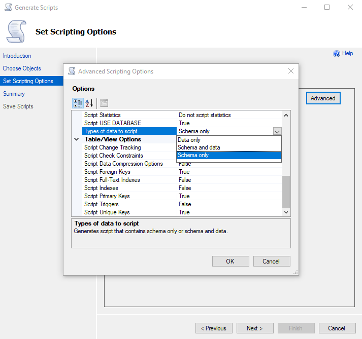
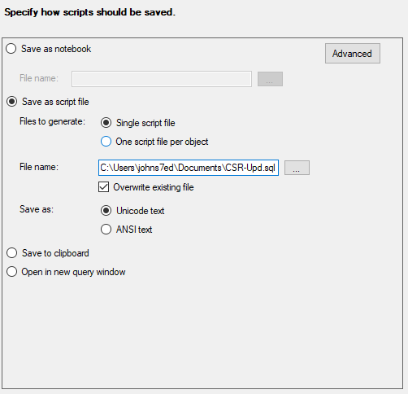
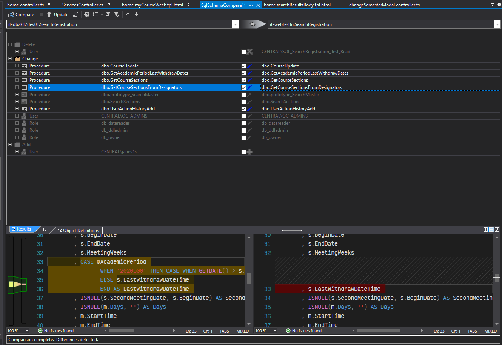
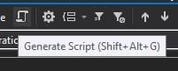

# Summary
There are many ways to do SQL Server database deployments to update the structure and logic (i.e., schemas) of our databases. Below are some tips on how to do that well.

## First Create a Restore Script of the Schema
This general process is describe in [Microsoft Docs](https://docs.microsoft.com/en-us/sql/ssms/tutorials/scripting-ssms?view=sql-server-ver15#script-databases). Note that nightly backup of database are available and can be restored by the IT_APPLICATIONS team, but this process takes usually about an hour, and early in the morning as you do a web deployment it may be hard to reach them.

### Notes
- Start by Right clicking on the Database > Tasks > Generate Scripts... 

- We generally only would Select **Tables**, **Stored Procedures**, and **User-Defined Functions**

- Most of the time you do **not** want to copy the data from production as well since it can make for a large file, so you could go with the **Schema only** type of script under the Advanced options

- Save the script to a `.sql` file. This file would allow you to restore the structure (but not the data if you did not choose that option above) of your database.

## Use **Schema Compare** in Visual Studio to See How Tables and Stored Procedures Vary Between Servers
This general process is describe in [Microsoft Docs](https://docs.microsoft.com/en-us/sql/ssdt/how-to-use-schema-compare-to-compare-different-database-definitions?view=sql-server-2017) and with images on [CSharpCorner](https://www.c-sharpcorner.com/article/compare-and-update-sql-server-database-project-with-visual-studio/).

### Notes
- We generally would **not** *Delete*, *Change* or *Add* **User** nor **Role** Data through this process, just *Add* or *Change* **Table** and **Procedure** objects

- The **Generate Script** button (which looks like a scroll) is a good idea, to save off to a `.sql` file the changes you are going to make.

- You can run **Update** but often running a small number of `ALTER` and `CREATE` scripts directly in SSMS on the server *receiving* the changes is preferred to you can commmit the changes a small piece at a time. Also when something breaks in the middle of your huge **Update**, it can be complicated trying to run the Update again, as `CREATE` scripts will break when run a second time.

## Tags
[[Database]](https://code.cmich.edu/search?project_id=365&repository_ref=master&scope=wiki_blobs&search=DatabaseTag)
[[Deployment]](https://code.cmich.edu/search?project_id=365&repository_ref=master&scope=wiki_blobs&search=DeploymentTag)