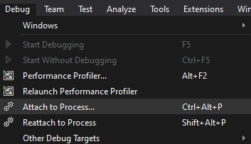

# Increasing Debugging Speed for Web Projects in Visual Studio (WIP)
This article is to give general tips that might help you decrease the amount of time it takes you to test your changes to `.cs`, `.js/ts`, `.css/scss/less`, and `.cshtml/html` files as they render in the browser. Obviously, to test your logic, unit testing should also be considered.

## Allow IIS Express to Keep Running
If most of your changes are to static files (i.e., `.js/ts`, `.css/scss/less`, and `.cshtml/html` files) you don't need to have Visual Studio constantly running in debug mode. You can still debug C# code, you just won't be able to edit the C# code and have it rebuild the project live.
To allow this disable **Enable Edit and Continue** in **Tools > Options > Debugging > General > Enable Edit and Continue**. 

### A Fast Way to Reconnect to ISS Express and Start Debugging Again
If you did stop debugging with **Enable Edit and Continue** disabled, *and you have **no** C# code changes*, you can reconnect via **Debug > Attach to Process...** and filter the list down to find "iisexpress.exe". If attaching again later, you can simply choose  **Debug > Reattach to Process**.

## Enabling Browser Link
If you like the workflow of having your browser auto reload every time you change HTML, JavaScript or CSS, then **Browser Link** should be enabled. Be sure to also check **Enable CSS Auto-Sycn** if you want the browser to automatically reload with CSS changes too.

There is another feature **Browser Sync** which will scroll, reload and do other things across separate browsers all at the same time for you, as you work in just one.
### Browser Link References:
- https://devblogs.microsoft.com/aspnet/browser-link-feature-in-visual-studio-preview-2013/
- https://docs.microsoft.com/en-us/aspnet/core/client-side/using-browserlink

## Other Common Debugging Option to Improve Performance
- To enable **Just My Code**, choose **Tools > Options > Debugging > General**, and then select **Enable Just My Code**
- To specify symbol loading (where to find and include .pdb files), choose **Tools > Options > Debugging > Symbols**
- To disable the **Diagnostic Tools**, start a debugging session, select **Tools > Options > Debugging > General**, and then deselect the **Enable Diagnostic Tools** while debugging option.

## General Tips for VS2019 to Increase Performance
- https://docs.microsoft.com/en-us/visualstudio/ide/visual-studio-performance-tips-and-tricks?view=vs-2019

## Tags
[[VisualStudio]](https://code.cmich.edu/search?project_id=365&repository_ref=master&scope=wiki_blobs&search=VisualStudioTag)