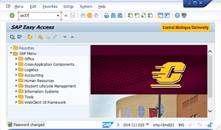
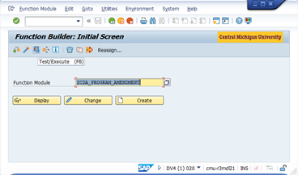
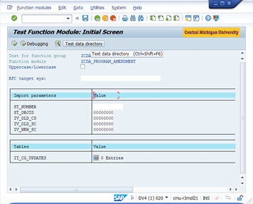
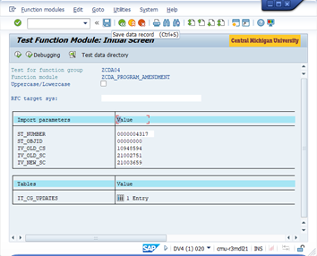
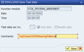
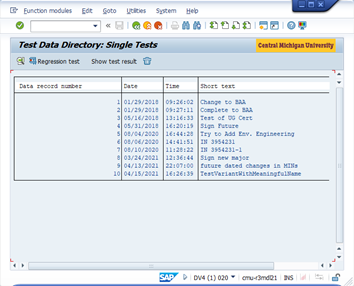

# Using the Test Data (Variants) Directory in SAP

When troubleshooting web applications that call SAP RFCs it is sometimes necessary to execute the RFCs directly in SAP. To share your findings with others, it can be helpful to save your test parameters using the Test Data (Variant) Directory. This allows others can execute the RFC with the same values you are using. This brief article describes how to access, execute, delete, and save items in the Test Data Directory.

## Working with the Test Data Directory

1. After logging into SAP with your [SAP-specific password](https://cmich.teamdynamix.com/TDClient/664/Portal/KB/ArticleDet?ID=20255), call the **SE37** transaction to access the _Function Builder_ screen.

   

1. Within the _Function Builder_ screen, enter the name of the Function Module and click the **Test/Execute** () button. Note, using wildcards (\*) will search for all function modules that match the given text.

   

1. You should now see the _Test Function Module_ screen. From here, you can click the **Test data directory** button to access the _Test Data Directory_ screen.

   

1. You should now see the _Test Data Directory_ screen. Clicking **Regression test**() will immediately execute the function module with the test parameters. Clicking **Delete**  () will delete the selected test. **Double-clicking** on a test or selecting a test and clicking the **Get test data** () button [F2] will take you back to the _Test Function Module_ screen with the test parameters already entered in case you want to review or modify them before executing.

   

## Saving a Test (Variant) in the Test Data Directory

1. Enter the **Import parameters** and **Tables** test values on the _Test Function Module_ screen. Then click the **Save data record** () button.

   

1. Provide a name for the test in the **Comments** field and click the **Save** button. Others will be able to use this name to find and execute your test.

   

1. The new test should now appear in the _Test Data Directory_ list of tests.

   

## Tags
[[SAP]](https://code.cmich.edu/search?project_id=365&repository_ref=master&scope=wiki_blobs&search=SAPTag)