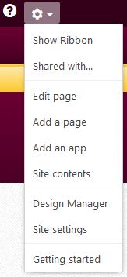

# How to add a redirect to a SharePoint page
If Ever you need to redirect users to an alternative page (inside or outside SharePoint) when they visit a certain page in SharePoint, these are the steps to do that. Note that *to check the functionality after you are done*, you need to visit the page in Incognito Mode in your browser or *have another non-admin user confirm that it works*.

## Steps
1. You will *need admin privileges* on the SharePoint page to perform this task. This can be confirmed by looking for the "Admin Gear"
1. From the **Admin Gear** select **Edit Page**

   
1. On the top of the page contents click **Add a Web Part**

1. In the Web Part Ribbon, select the CMich Folder, and *right arrow* through the options to find **Page Redirect** and click the **Add**

   
1. On the new Redirect Web Part click the *small drop down arrow* and select **Edit Web Part**

   
1. The *Edit Web Part* options menu should appear on the right side of the screen. Expand the **Miscellaneous** section
1. In **Redirection URL** enter the desired URL you want site visitors to end up seeing. Click the **OK** Button.

   
1. You will now need to *Check In* (with useful comment) and *Publish* the page.

   
   

## Tags
[[SharePoint]](https://code.cmich.edu/search?project_id=365&repository_ref=master&scope=wiki_blobs&search=SharePointTag)
[[Redirect]](https://code.cmich.edu/search?project_id=365&repository_ref=master&scope=wiki_blobs&search=RedirectTag)