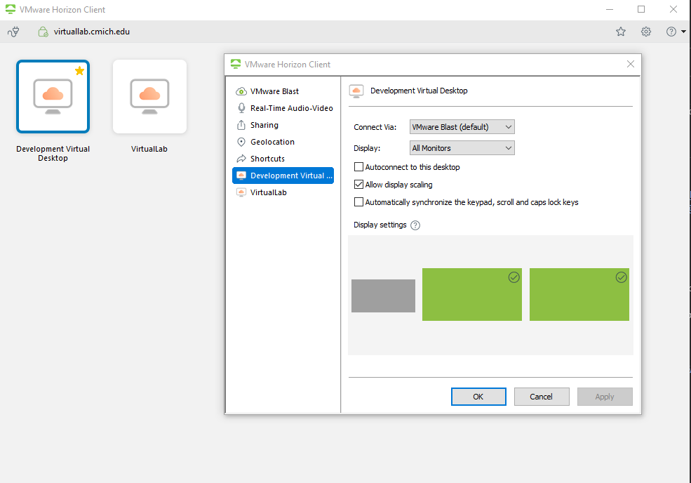
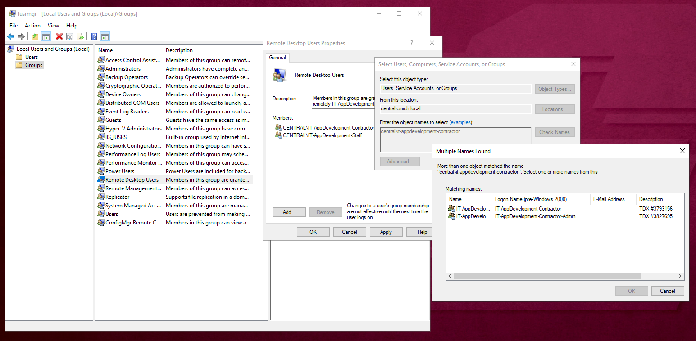
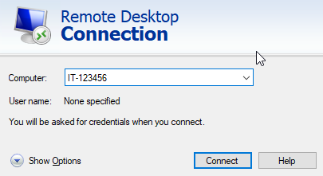

# Using Your Dev VM Desktop
The *preferred method* is to use **[VMware Horizon Client](https://cmich.teamdynamix.com/TDClient/664/Portal/KB/ArticleDet?ID=20376)**. Other methods that are more complicated are mentioned below.
1. Install the **VMware Horizen Client**
1. Double-click the **virtuallab.cmich.edu** icon
1. Login using your CMU Credentials (i.e., globalId and password)
1. Double-click **Development Virtual Desktop**
   - Other customization, such as using multiple monitor, etc. Can be setup by clicking the ⚙ (gear) in the top right.

## Setting up VPN Access
1. Submit a helpdesk [Active Directory ticket](https://cmich.teamdynamix.com/TDClient/664/Portal/Requests/ServiceDet?ID=15012) asking to be added to the Active Directory Group `VPN-Web`
1. **VPN Client**
   - Primary - [GlobalProtect (Palo Alto) VPN Client](https://cmich.teamdynamix.com/TDClient/664/Portal/KB/ArticleDet?ID=36303) using `vpn.cmich.edu`
   - Backup - **AnyConnect VPN Client** using `sg3.cmich.edu` ([University provided laptop](https://www.cmich.edu/office_provost/OIT/Download/Pages/default.aspx) or for private devices see [Personal Computer Downloads](https://www.cmich.edu/office_provost/OIT/Download/Pages/default.aspx))

## Setting up Remote Desktop Connection
1. On your desktop you will need to open your local user manager. To do this do one of the following:
   - open the `Run` app and type in `lusrmgr.msc`, click OK to open
   - with the start menu open simply type `Edit local users and groups` to find the program, click to open
   - from a command prompt type `lusrmgr` and hit enter
2. Once open navigate to `Groups > Remote Desktop Users`
3. Click `Add` and enter the Active directory Group `IT-AppDevelopment`
4. Make sure you click `Apply` or this change will not take.

## Logging in
1. Connect to the [VPN Client chosen above](#setting-up-vpn-access) and then log in with your global id and password
2. Open `Remote Desktop Connection` which can be found by searching in your Start bar under `Windows Accessories`
3. Enter your computer ID into the remote desktop prompt (The ID can be found on the sticker on the device, the computer name should be `IT-[number on sticker]`):  

4. You will then be prompted for username and password

## Tags
[[Remote]](https://code.cmich.edu/search?project_id=365&repository_ref=master&scope=wiki_blobs&search=RemoteTag)