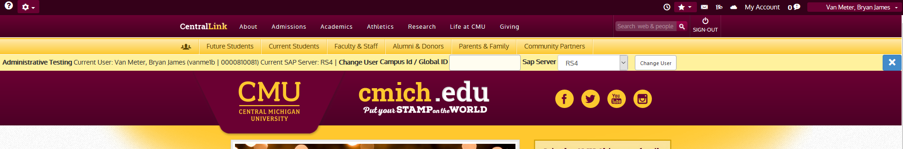

# Enable SP Admin Test bar for your GUID

The SharePoint Admin Test Bar allows developers to impersonate other users. This guide focuses on accessing the bar in betaweb/stgweb environments.

To enable the Admin Test bar for your account, you have to first know which database the environments are using.

As of January 2020, our non production SharePoint servers are pointed at `it-webtestln`.

Look for a Schema called `PortalApplicationConfig`.

In PortalApplicationConfig, look for the `Settings` table.

In the Settings table, look in the "Application" column for "SiteHeader", and then in the "Setting" column its the "Admin Testers" row. There is a semicolon separated list of GUIDs with access. Add yours to the list and you're good to go!

SharePoint also has a debug mode, and for this, you just need to add the URL parameter "debug=1". This will give your session ID among other things.

## Tags
[[SharePoint]](https://code.cmich.edu/search?project_id=365&repository_ref=master&scope=wiki_blobs&search=SharePoint)