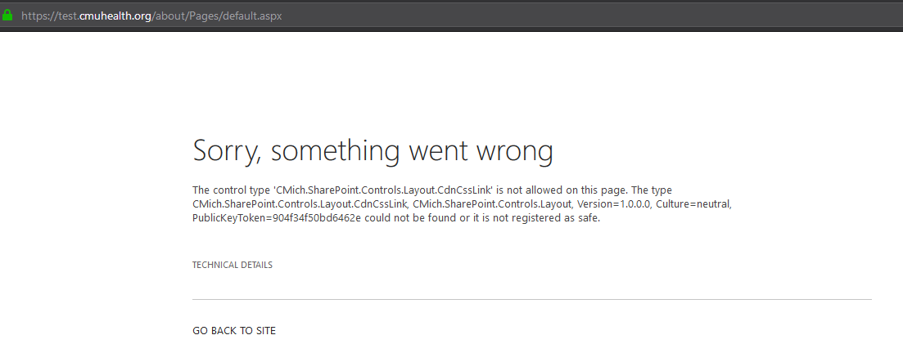
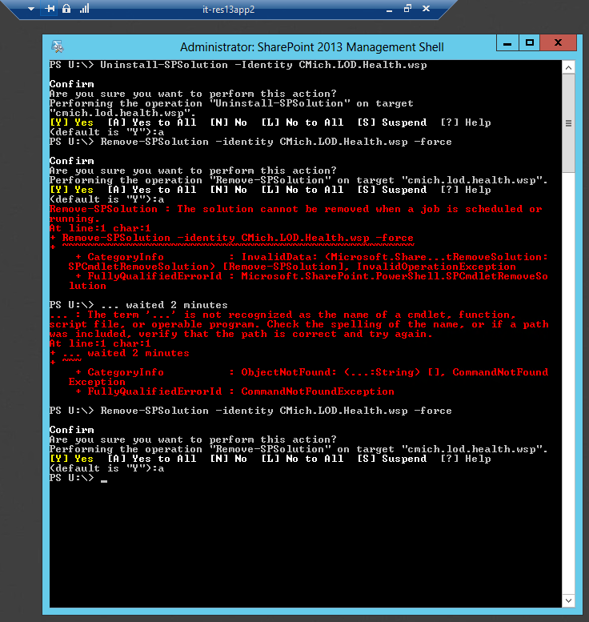

# Share Point: Fix for The control type '{item}' is not allowed on this page

## Problem
Screenshot below showing that one sub-site is not loading.

## Solution (Remove and Reload the .wsp)
(In this example we will use *CMich.LOD.Health.wsp* as our example wsp)
1. Remote into it-res13app2
1. Open SharePoint 2013 Management Shell
1. Run `Uninstall-SPSolution -Identity CMich.LOD.Health.wsp` (you must wait for 2 minutes after running this before you run the next line or you will get "The solution cannot be removed when a job is scheduled or running.")
1. Remove-SPSolution -identity CMich.LOD.Health.wsp -force
1. Re-deploy CMich.LOD.Health.wsp
   - Have a folder with today's date (e.g., '2019-05-13') in `D:\1-Deployments` with the desired version of CMich.LOD.Health.wsp in it
   - Double click `Deploy-SolutionsByTimestamp.bat` to run the deployment as admin
   - You can close the auto opened *Windows PowerShell ISE*
1. To confirm it's there
   - Sign-in to SharePoint > ⚙ (gear) > Site Settings > Site Collection Features and look for **CMich.LOD.Health**

## More Reading
https://sharepoint.stackexchange.com/questions/11493/retracting-solution-from-central-admin/11498#11498