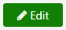
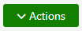
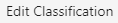
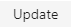
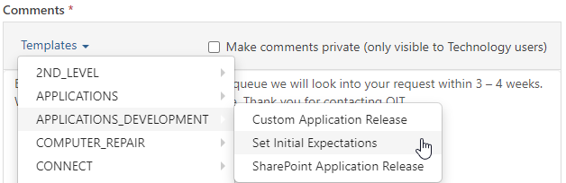
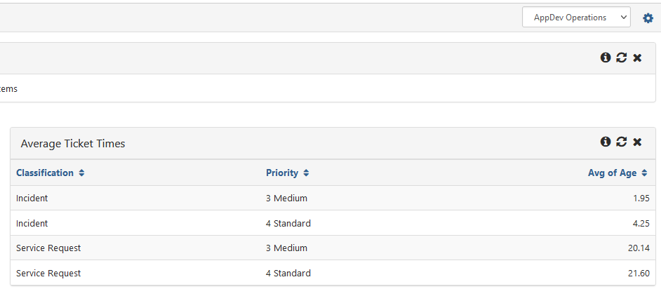

## Terminology
**Service Request:** request from a user that requires us to take an action such as: 
- updating/changing existing functionality
- adding/removing user access to a system

**Incident:** interruption of service or reduction in the quality of service (something is broken or not running as it should)
	
**Problem:** cause, or potential cause, of one or more incidents
	
**SLA:** an agreement between a service provider and the customer that identifies the expected level of service

## Determining SLA		
- [Knowledge Base Article](https://cmich.teamdynamix.com/TDClient/664/Portal/KB/ArticleDet?ID=35894)
- [SLA Matrix](https://cmich.teamdynamix.com/TDClient/664/Portal/Shared/FileOpen?AttachmentID=3b310745-7b0c-42ae-bf97-b1905f9243a2&ItemID=35894&ItemComponent=26&IsInline=-1) - (can also be found as an attachment in the KB above if link not reachable)

## Triage (Setting Expectations)	
1. Set Impact and Urgency based on the SLA Matrix above. Priority will be automatically set based on these fields. 
   - Click 
   > ℹ Note the requestor can reply to say "this need to be worked on sooner". In which case you can elevate the urgency to "High Urgency" and let them know that you have updated based on their feedback.
1. Set Classification per terminology above. 
   - Click  > 
1. Use Closed Ticket Age or Average Ticket Times report to get estimated time to complete (TDX Operations Dashboard or Report)
   - If the queue is low you may need to estimate lower than the ticket times report
   - Always estimate higher than you think it will take us to complete (for instance if you think we will get to it in 5 days say 1-2 weeks)
     - better to come in under time than over
1. Set the status to Expectations Set. 
   - Click  > 
   - Add .25 hours of time 
   - Use the App Dev template 'Set Initial Expectations', you will need to manually enter time from step 3 (defaults to 3 - 4 weeks)
   
   - The estimated time can be determined on the **AppDev Operations Dashboard** > [Average Ticket Time](https://cmich.teamdynamix.com/TDNext/Apps/Reporting/ReportDetail?ID=77442)
   

### Courses Search and Registration Specific Triage
- For `[Unhandled Exception] Course Search & Registration` tickets
  - Attach to parent https://cmich.teamdynamix.com/TDNext/Apps/393/Tickets/TicketDet?TicketID=3797066
  - If it is **not** an active, or ongoing issue you can resolve the ticket and mention "Infrastructure related, see parent."
- If a ticket comes in saying a student is seeing that they are "not admitted" when they should be:
  - That should've normally gone to the Registrar's office instead of being routed to our queue
  - The best course of action is for the student to call the Registrar's office, and if the office deems it is a technical issue (instead of an SAP data issue) then they will submit a ticket to us
		
## Tags
[[TeamDynamix]](https://code.cmich.edu/search?group_id=&project_id=365&repository_ref=master&scope=wiki_blobs&search=taggedWithTeamDynamix)