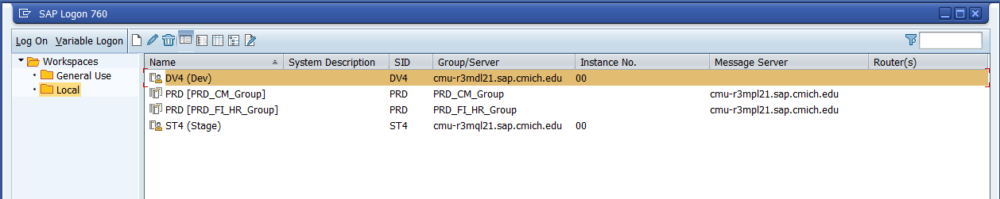
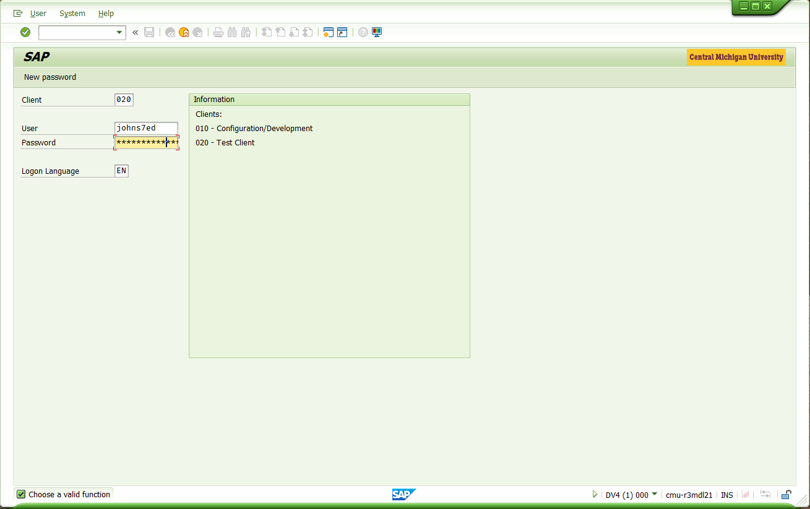
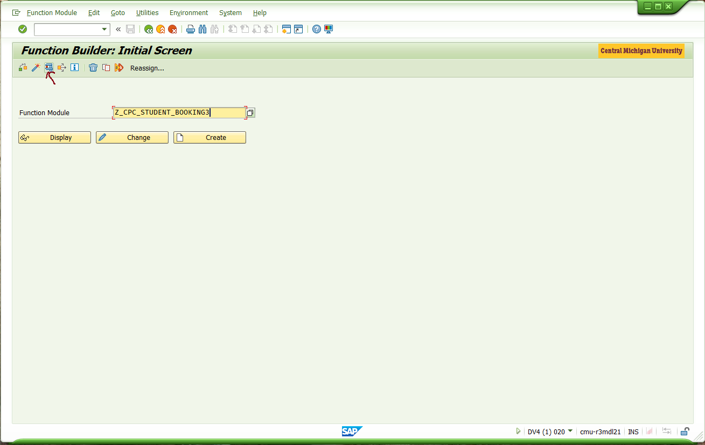
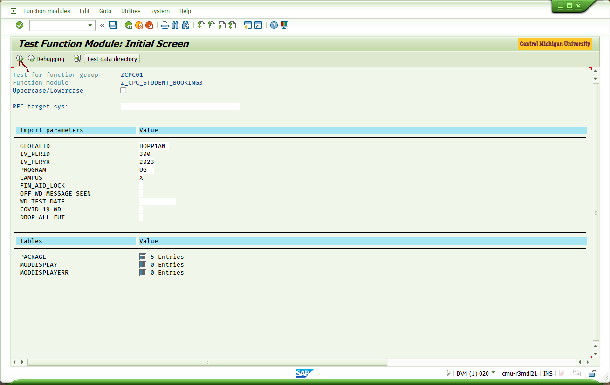
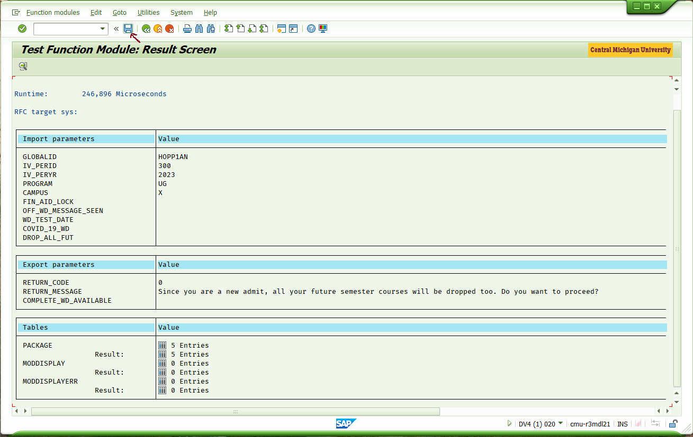

# How to SAP like a Novice (WIP)

## Using SAPGUI
1. Launch SAP GUI Logon for **DV4** 
    
   <!---->
1. Sign in with your Sv4 SAP credentials (not your normal Single-sign-on password) 
   >ℹ To setup or reset your SAP Password follow this [KB Article SAP: Changing Own Password](https://cmich.teamdynamix.com/TDClient/664/Portal/KB/ArticleDet?ID=20255)
   
1. Selecting your **Transaction-Code** `SE37` (also recommend going into **PRD** SAP and added all the favorite shown in the screenshot for easy reference. If you don't add them in prod they get wiped out each data refreshed, about three times a year) 
   

## Creating Test Data Directory (aka, Variants) as Inputs for RFC Testing
1. Enter your RFC to be tested, **Z...** and click the *wrench* icon 
   
1. Enter your desired data **or** select from existing Test Data examples, then click the *clock with the check-mark* to call the RFC 
   
1. If you see the results you want to share with other, click the *disk* to save the *inputs you used* (note: this does **not** save the results, just the inputs, so others can call the RFC as well. Some RFC calls, such as booking a course, update data, and so calling the RFC without resetting the data will results in different results-you can book a class you are already in, etc.) 
   

## Tags
[[SAP]](https://code.cmich.edu/search?project_id=365&repository_ref=master&scope=wiki_blobs&search=SAPTag)