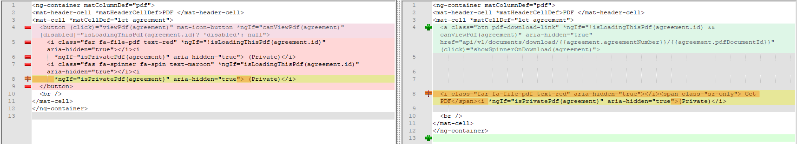
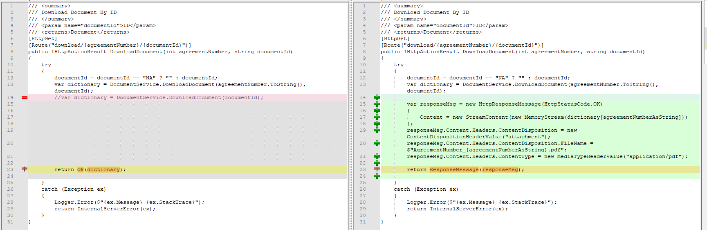

# Firefox  
## Localhost HTTP Error 500.0 - Internal Server Error (Error Code 0x80070542).

When running an application that uses Windows authentication in IIS Express (or Visual Studio debugger), you may encounter TTP Error 500.0 - Internal Server Error (Error Code 0x80070542) issues.  Even requesting images or css files will produce this error.  After flailing about for 45 minutes, you may try another browser, only to find the issue apparently lies with Firefox.  It appears that, by default, Firefox does not support Windows integrated authentication.

https://stackoverflow.com/questions/22025007/asp-net-mvc-application-gives-internal-server-error-only-when-viewed-in-firefox

From the discussion:
1.  In Firefox, type **about:config** in the location bar.
1.  search for **ntml**.
1.  Double-click the **network.automatic-ntlm-auth.trusted-uris** preference and add "localhost" to the value.

This adds localhost to list of sites within Firefox that will automatically utilize Windows integrated authentication.

# Angular Material: File downloads
## How to change PDF/XLSX download from AJAX to direct download

This comes from an experiment in in the "Agreements" custom application.
So at one point we were thinking that it would simplify things to strip out the Ajax that re-assembles (on the client side) a download from a streamed blob of a pdf. So we went to the trouble of making the server assemble the blob into the pdf before sending it to the client, eliminating the need for AJAX code in the Typescript file. We could then bypass the JS functions that assembled the blob and replace the button that called these functions with a simple anchor tag. In the end, it wasn't really any better. We lost the ability to track download progress or know when the download was completed. Even worse, if the app needed any kind of authorization or CSRF protection, the direct download method went against the grain, and we would have had to so some cookie and session hacking workaround. For the sake of documenting, here is how to pull it off.

This is the code on the client side to make the button into a direct link:

And this is the code on the server side that assembled the pdf instead of streaming the blob:

## Tags
[[Firefox]](https://code.cmich.edu/search?project_id=365&repository_ref=master&scope=wiki_blobs&search=FirefoxTag)

