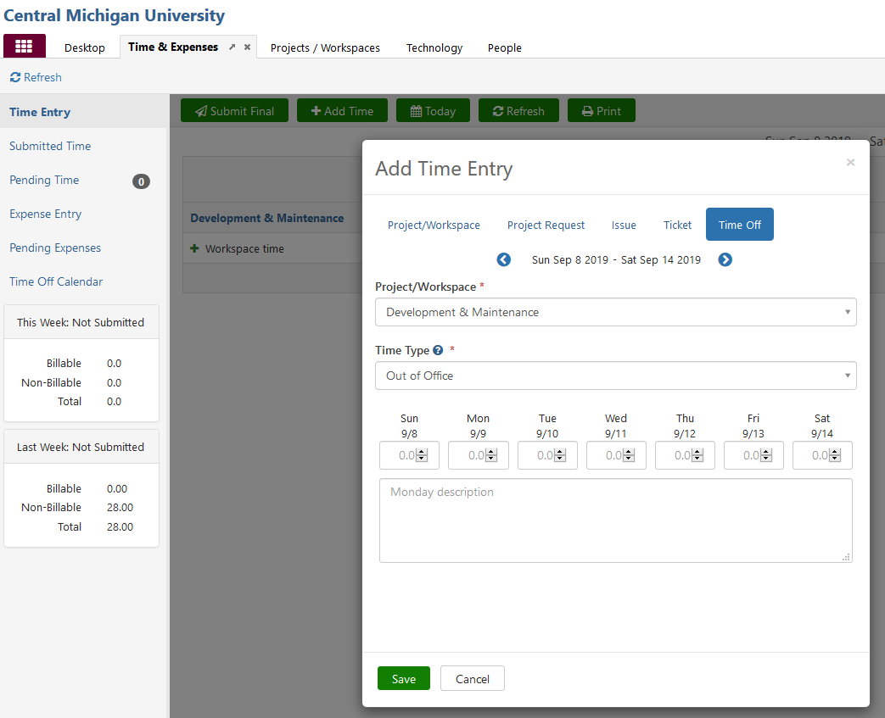

# Planned
* **Approval**
    * Planned absences have to be pre-approved by your supervisor and should be submitted as soon as known.  A two week notice ***or more*** is preferred.
    * Requests should be submitted via email.  
* **Update Calendar**
    * Create an Outlook Appointment that indicates your time out of the office making sure the "Show As" time is set to "Out of Office"
    * Decline any meetings that you had previously accepted over that peroid
* **Update Email**
    * Set an Automatic Reply on your email indicating when you will be leaving and when you will be returning as well as a point of contact while you're away.
        * Recommended:  `This is an automatic reply - I will be out of the office XX/XX/XXXX - XX/XX/XXXX with limited access to email. If you need immediate assistance please email helpdesk@cmich.edu or call x3662. Thank you, {Your Name}`

* **Update Team Dynamix** 
    * Under **Time & Expenses**, select **Add Time** -> **Time Off** -> **Project/Workspace**: Development & Maintenance -> **Time Type**: Out of Office.

# Unplanned
* **Notification**
    * Unless it is an extreme emergency, please contact your supervisor letting them know the situation.  If your supervisor is unavailable or has a planned absence during that period please contact office secretary (Jodi Drouse, [drous1jm@cmich.edu](mailto://drous1jm@cmich.edu), 989-774-3612)
* **Update Calendar** - if possible, follow the requirements listed above
* **Update Email** - if possible, follow the requirements listed above
* **Update Team Dynamix** - if possible, follow the requirements listed above

## Tags
[[Office365]](https://code.cmich.edu/search?project_id=365&repository_ref=master&scope=wiki_blobs&search=Office365Tag)
[[Policy]](https://code.cmich.edu/search?project_id=365&repository_ref=master&scope=wiki_blobs&search=PolicyTag)
[[Email]](https://code.cmich.edu/search?project_id=365&repository_ref=master&scope=wiki_blobs&search=EmailTag)
