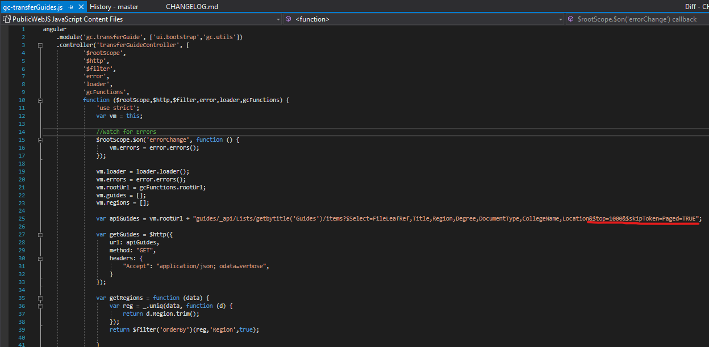

If you're adding items to SharePoint lists and come to find out that some are missing from the web page, just know that SharePoint's  API for requesting list items has a default limit of 100 results. To allow more, you just need to pass in some additional params to the web request.

Here's an example of the solution:

## Tags
[[SharePoint]](https://code.cmich.edu/search?project_id=365&repository_ref=master&scope=wiki_blobs&search=SharePoint)