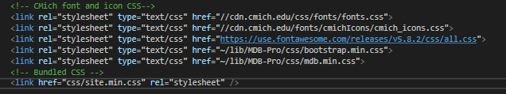

# Introduction to CSS
In this assignment, you will be learning CSS (Cascading Style Sheet), the style sheet language used to define the look and feel of a website.

## Outcome(s)
* Gain knowledge about CSS
* Apply CSS to style a page

## Resource(s)
* CSS Tutorial - http://www.w3schools.com/css/default.asp - Please read all pages listed under 'CSS Tutorial', 'CSS Advanced', 'CSS Responsive', and 'CSS Grid' in the left column of the site.
* Take the CSS Quiz - http://www.w3schools.com/css/css_quiz.asp - Take the quiz as many times as you need. Feel free to refer to the resources if you need help.

## Key concepts
* Know how selectors work - Remember, IDs are unique. Try not to rely too hard on them for styling. Instead use well crafted classes and specificity (more on this later).
* Understand the cascade - If you define the same rule (same selector and attribute) multiple times, the attributes of the last rule will override the previous rule(s). Also, if same rules exist in multiple style sheets, the last rule of the last style sheet brought into the web page wins. So for example, note the order that these libraries are brought into this page:
 
MDB is an extension library of bootstrap, so it has styles that override the core bootstrap library styles. To override any of those though, we add our own custom styles into site.css, which is loaded *last*.
* Do not abuse !important - Try to avoid using this beast if you can. Other developers might have to use it to override your stuff later. It's considered a nuclear option, and often leads to mutually assured destruction.
* Understand specificity - Specificity is when you compound selectors. The more specific you are with compound selectors, the harder they are to override without nuking them (this is !important). High specificity selector syntax takes a little while to get used to. Just know that complex selectors on the same element require no spaces, unlike complex selectors targeting nested elements do have spaces.

## Assignment
Create a copy of *Assignment 1: Basic HTML*. 
Rename the copy *Assignment 2: Basic CSS* and update the titles in the file accordingly.
Using the text editor of your choice, you'll create a valid CSS file to style the HTML by targeting key elements.
Include this CSS file in the HTML file you just made.

### All elements (`*`)
set box-sizing to border-box.

### Header (`header`)
Set a margin on the top and bottom of 10px

Set the background color white

Center the text

Set a 2px solid border with 10px rounded corners

### Container (`.container`)
Set the width to 960px

Center the container horizontally *- hint: set margin to auto*

Set a background color of your choice

### Container-inner (`.container-inner`)
Set the width to 960px

### Left Panel (`.leftPanel`)

Set width to 640px

Float the element to the left

Add a padding of 10px

### Right Panel (`.rightPanel`)
Set width to 280px

Float the element to the *left*

Add a padding of 10px

### Footer (`footer`)
Set width to 960px

Center the footer element horizontally

Set a background color of your choice

Give the footer element rounded corners of 10px

Validate the CSS- http://jigsaw.w3.org/css-validator/. Fix all errors and warnings (In reality, warnings are usually not a big deal. Libraries are often full of them!)

## Gotchas
Notice the footer is NOT at the bottom and looks all screwed up. To fix this, add `clear: both;` 

Also notice that the background color you applied to the content div isn't showing up. This is because it contains floated elements, and floated elements only respect each other, but not their container! To fix this, there is what's called the "clearfix" hack. In short, you just have to add `overflow: auto;` to the inner container and then "poof"! It can magically see the height of floated elements inside of it.

**Submit both the CSS file and the modified HTML file (now including a link to your CSS document) to your Team Lead.**
  

<strong>Fluid layout: check this stuff out!</strong>

  
If you shrink the window narrow and watch what goes on with the above CSS, you'll notice that it's totally rigid!
Here is some alternate CSS you can add and and study. Plug in the following CSS file in place of the one you just made above. 

[styles-fluid.css](uploads/173b4def783ed8db55ccd837de55a206/styles-fluid.css)

Notice we got rid of the floats and made the left and right panels display as inline-block. This means they have width/height of block level elements, but like inline elements, they don't have a line break afterwords.

Also notice how the widths are defined. The container has a max-width of 960px, but 100% width if under 960. Then notice the left and right panels. They use calculated widths based on the width of their container. The left panel is just under 2/3 of the container width, and the right panel is just under 1/3 of the width, with both pannels also having 40px subtracted to account for the margins and padding of themselves and their containers.

## Training Navigator
[<--- Basic HTML](https://code.cmich.edu/IT-AppDevelopment/Documentation/wiki/-/wikis/Training-Assignment-1---Basic-HTML) ________________________________________
[Zen Garden --->](https://code.cmich.edu/IT-AppDevelopment/Documentation/wiki/-/wikis/Training-Assignment-3---CSS-Zen-Garden)

  
## Tags
[[CSS]](https://code.cmich.edu/search?project_id=365&repository_ref=master&scope=wiki_blobs&search=CSSTag)
[[Training]](https://code.cmich.edu/search?project_id=365&repository_ref=master&scope=wiki_blobs&search=TrainingTag)