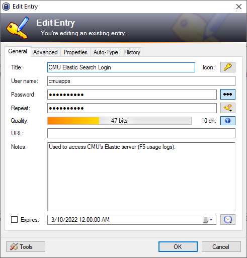
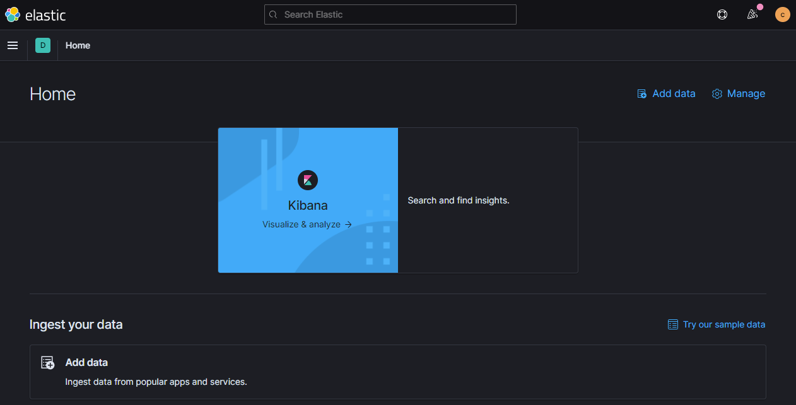
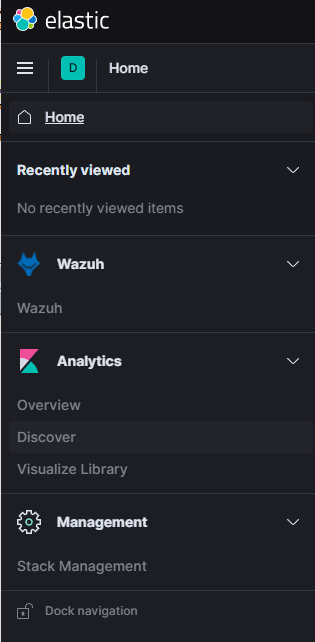
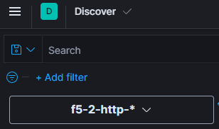
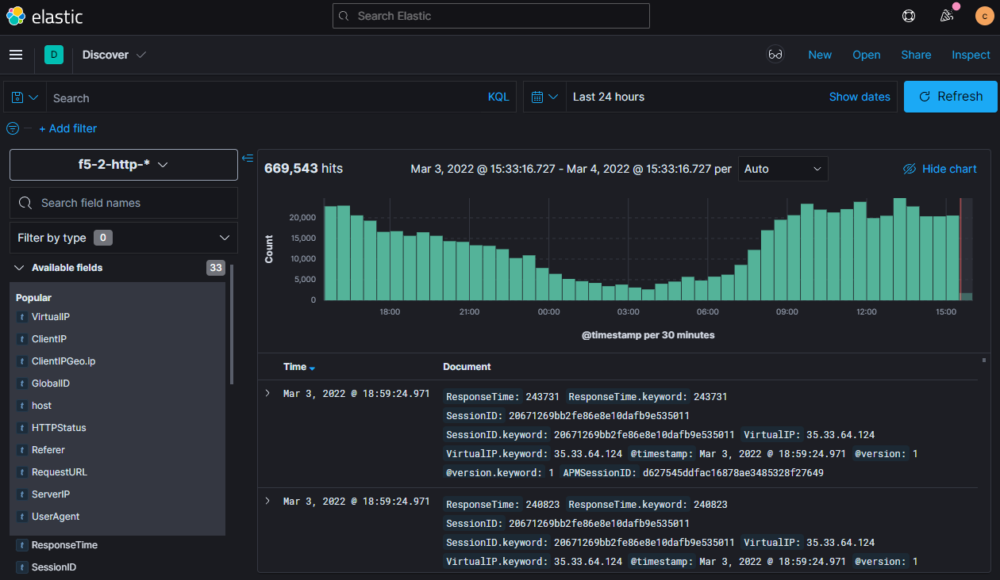
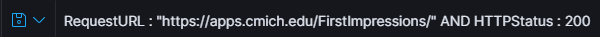
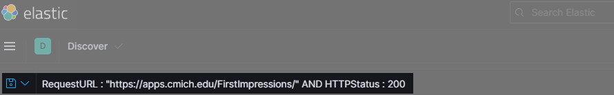
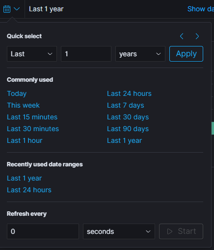
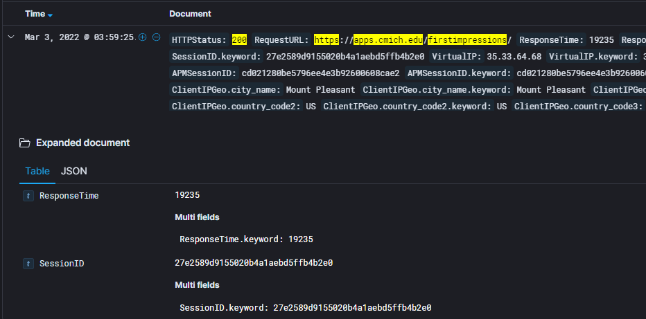

# Summary
There are times when it is helpful to know if or how web applications are utilized.  F5 usage logs can be searched using CMU's Elastic server (sometimes referred to as "ElStack") to learn about traffic and if certain URLs are being hit, if so what type of traffic or requests are coming in.

You can access the [Elastic Server](https://it-el1-kib1:5601/app/home#/) generally or jump into a direct link to the [F5-2-http-* Logs](https://it-el1-kib1:5601/app/discover#/?_g=(filters:!())&_a=(columns:!(),filters:!(),index:dd424270-ed5d-11ea-9078-435507025d2b)).

## Logging into The F5 Elastic Server
Login credentials are stored in KeePass under **AppDev** > **Other** > **CMU Elastic Search Login**.

<!--

-->

## Filtering the F5 Logs

The default view does not include any filtering and shows information for the last 24 hours (including traffic from within the last few seconds).

Free text searches are supported, but using [Kibana Query Language](https://www.elastic.co/guide/en/kibana/current/kuery-query.html#_boolean_queries) will provide more accurate results.  The example below searches for requests to "https://apps.cmich.edu/FirstImpressions/" with a return code of 200.  Note that one must used to correct search box on the page.  
<!---->

One can also set the data ranges:  

Clicking the disclosure triangle ">" will show more detailed information for a given result.  

