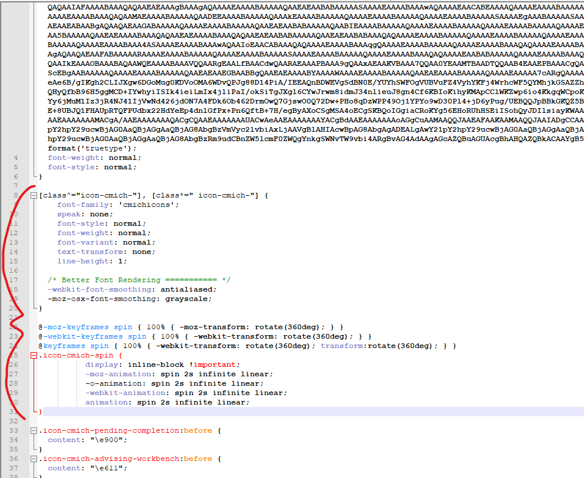

# Adding to the CMich icons pack

The CMich icon pack is generated in IcoMoon. While fairly straight forward, there are a few gotchas that need to be mentioned. This guide will help you add new icons to the icon pack when it's found to be lacking while avoiding the gotchas.

*  In [the repository](https://code.cmich.edu/IT-AppDevelopment/CustomApplications/CMichCDN/-/blob/master/CMichCDN), you'll notice a [Read Me.txt file](https://code.cmich.edu/IT-AppDevelopment/CustomApplications/CMichCDN/-/blob/master/CMichCDN/fonts/cmichIcons/Read%20Me.txt). This was generated by IcoMoon, and has a few pointers. It mentions uploading `selection.json` to load the existing icon collection. After that, you can add to the selection and generate a new icon pack.

*  When you generate a new icon pack, it will have a file called `styles.css` . This must be renamed to `cmich_icons.css`. You'll  also need to minify it (so you have `cmich_icons.min.css`). Note that renaming these will break the included `demo.html` file since it's looking for `styles.css` instead of `cmich_icons.css`, so you'll have to find and fix that in `demo.html`. This is important because other developers and content creators use [the icon demo page on stgcdn01](https://stgcdn.cmich.edu/Fonts/cmichicons/demo.html) to know what's at their disposal, so don't skip this step!

*  In the past, IcoMoon used to Base64 encode and embed the fonts right into the CSS file. At some point, this functionality became a premium feature that requires a paid "subscription". Just to be safe, you'll need to convert `cmich_icons.ttf` into Base64 using the free online tool of your choice (like this one: [base64encode.org](https://www.base64encode.org/enc/font/), scroll down to upload a file) and embed the code in the CSS file. Use the existing cmich_icons.css file as a reference. 

*  Copy the following section out of the existing cmich_icons.css file and paste it over the same section in the new file to replace the rule that targets \<i\> tags and also add the spinner class (i.e., `.icon-cmich-spin`) back to the file:

If you don't do this, you'll break all bootstrap glyphicons that use \<i\> tags in cmich.edu, and we don't want that!

## Tags
[[Icons]](https://code.cmich.edu/search?project_id=365&repository_ref=master&scope=wiki_blobs&search=IconsTag)