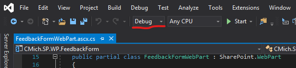
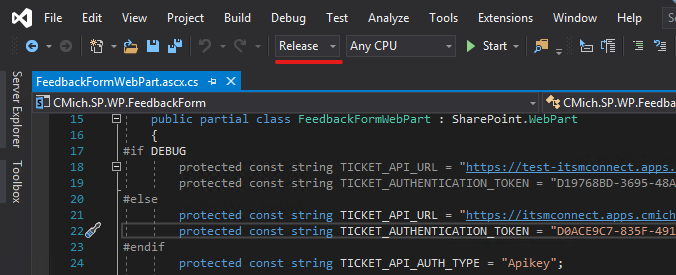

# Summary
Deploying to SharePoint is a join effort between the AppDev team and the AppSupport team.  This document outlines the process for deploying SharePoint code to production

## Process Overview
1.  Develop on local machine
1.  Deploy debug build to Test (Beta/Res) Environment
1.  Deploy release/production build to Staging
1.  Schedule Release
1.  Deploy to Production

### Develop on local machine
1.  Development Servers
    * `OC-SP2013` 
    * `it-sp13-d-app1` / `it-sp13-d-app2` / `it-sp13-d-app3`
1.  Once coding is finished, publish a **Debug** build by right clicking on the project's name and selecting "Publish ...".  
   
   
1.  Then save the package (your `.wsp` file) to your local machine, not the server  
     

### Deploy to Test (Beta/Res) Environment
1.  Beta/Res Server
    * IT-RES13APP2
1.  Developer puts package into the Deployments folder with the appropriate date:
    * Use Remote Desktop Connection to connect to server.
    * D:\1-Deployments\YYYY-MM-DD
    * Run PowerShell script Deploy-SolutionsByTimestamp.ps1

### Deploy to Staging
1.  Developer creates a **Release/Production** package same as above but you must select the right configuration **Release/Production**.
   
    > 🛑 If deploying [CMich.LOD](https://code.cmich.edu/IT-AppDevelopment/SharePoint/Layouts/CMich.LOD), you must have CMich.SharePoint.dll **already compiled to match the tier** (e.g., **Debug**, **Staging**, **Release/Production**) you are deploying to, if not SharePoint will point to the wrong database tier and very bad things will happen.
1.  Developer puts this package into the staging server's "To Be Depolyed" folder: (just copy the file there)
    * SP-STGApp02\D$\1-Deployments\To Be Deployed\ (or: \\\\sp-stgapp02\Deployments\To Be Deployed\ )

### Schedule Release
1.  Go through [How to request a deployment](https://code.cmich.edu/IT-AppDevelopment/Documentation/wiki/-/wikis/how-to-request-a-change-calendar-deployment) and for step 4 of Change Ticket Production Deployments, select the Sharepoint template

### Deploy to Production

### Docs
[SharePoint_Deployment_-_Developer_Edition.pdf](/uploads/57de7f7d0fb7ef7d040291c7bbb0b8f9/SharePoint_Deployment_-_Developer_Edition.pdf)

## Tags
[[SharePoint]](https://code.cmich.edu/search?project_id=365&repository_ref=master&scope=wiki_blobs&search=SharePointTag)