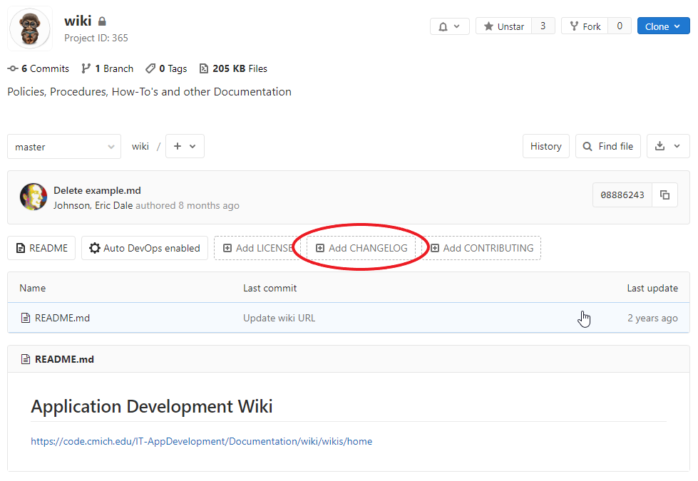

# Why keep a changelog?
[Keeping a changelog](https://keepachangelog.com/en/1.0.0/) makes it easier for users and contributors to see precisely what notable changes have been made between each release (or version) of the project. This meant for people. Whether consumers or developers, the end users of software are human beings who care about what's in the software. When the software changes, people want to know why and how.

# Adding a new changelog
1. Click **Add Changelog** from the main project page
> 
1. Enter the new File name as `CHANGELOG.md`
1. Paste in the template below and begin editing
1. You are all done! If your project is becoming a NuGet package for others to consume, you may be interested in [making a tag](How-to-Make-a-Tag-for-NuGet-Packages)

# Template and Styling
## Base Template
```md
# Changelog
All notable changes to this project will be documented in this file.

## Unreleased
- None at this time

## [Change Ticket Number](url to change ticket) - yyyy-mm-dd
### Changed
- [Service or Incident Ticket Number](link to service request or incident): Switched to CMich Projects instead of NuGet DLLs
 
## yyyy-mm-dd
- Initial release of this application
```
## Styling
When starting a new Changelog you can copy and paste this template into the new document. When editing Changelogs please conform to these styling rules:

1. Each change ticket should be denoted on the `H2` header lines by `##`
   - e.g. (using no versioning): 
     ```
     [3918715](https://cmich.teamdynamix.com/TDNext/Apps/393/Tickets/TicketDet.aspx?TicketID=3918715) - 2020-03-25
     ```
   - Optionally using ([Semantic Versioning](http://semver.org/)): 
     ```
     [3918715](https://cmich.teamdynamix.com/TDNext/Apps/393/Tickets/TicketDet.aspx?TicketID=3918715) - [2.4.0](https://code.cmich.edu/IT-AppDevelopment/CustomApplications/CourseSearchRegistration/-/tags/v2.4.0) - 2020-03-25
     ```
1. Under each `H2` header there should be **at least** one `H3` header denoted by `###` stating the change type:
	- Types of Entries:
	   - `Added` - new features
	   - `Changed` - alter the way existing features work
	   - `Deprecated` - features soon-to-be removed 
	   - `Security` - fixing vulnerabilities
	   - `Removed` - removed features
	   - `Fixed` - bug fixes
 1. Under each `H3` header there should be a list of tickets/changes made, these should be links to the Service Request or Incident
    ```
    [3874754](https://cmich.teamdynamix.com/TDNext/Apps/393/Tickets/TicketDet.aspx?TicketID=3874754): new `IsDeanOnlyAccess` flag to require dean review
    ```
    For any Projects or Requests use the following format without a link
    ```
    Project #123456: Sample Project reference
    Request #123456: Sample Request reference
    ```
## Example
> # Changelog
> All notable changes to this project will be documented in this file.
> 
> ## Unreleased
> - None at this time
> 
> ## [3940800](https://cmich.teamdynamix.com/TDNext/Apps/393/Tickets/TicketDet?TicketID=3940800) - 3.1.0 - 2020-06-04
> ### Added
> - Allow attachments to Ask for Exception
> - Add optional text on every Ask for Exception
> - Allow withdraw of a Registration Exception
> - Allow students to link to status of Registration Exception in Workflow
> - Show students "Registration Exception: Needs your attention" in Planned courses
> 
> ### Fixed
> - [3936230](https://cmich.teamdynamix.com/TDNext/Apps/393/Tickets/TicketDet.aspx?TicketID=3936230): If ModuleId is missing use DeptCode + CourseId as a backup in Search Results
> - [3939389](https://cmich.teamdynamix.com/TDNext/Apps/393/Tickets/TicketDet.aspx?TicketID=3939389): After Registration Exception is Approved removed the matching planned course
> - [3939410](https://cmich.teamdynamix.com/TDNext/Apps/393/Tickets/TicketDet.aspx?TicketID=3939410): Ft Belvoir to Fort Belvoir
> - [3937685](https://cmich.teamdynamix.com/TDNext/Apps/393/Tickets/TicketDet.aspx?TicketID=3937685): Gray sticky course previews on My Course Week now self-remove
>  
> ...
>
> ## 2020-03-20
> - Initial release of this application


## Tags
[[Development]](https://code.cmich.edu/search?project_id=365&repository_ref=master&scope=wiki_blobs&search=DevelopmentTag)
[[Template]](https://code.cmich.edu/search?project_id=365&repository_ref=master&scope=wiki_blobs&search=TemplateTag)
[[Git]](https://code.cmich.edu/search?project_id=365&repository_ref=master&scope=wiki_blobs&search=GitTag)
