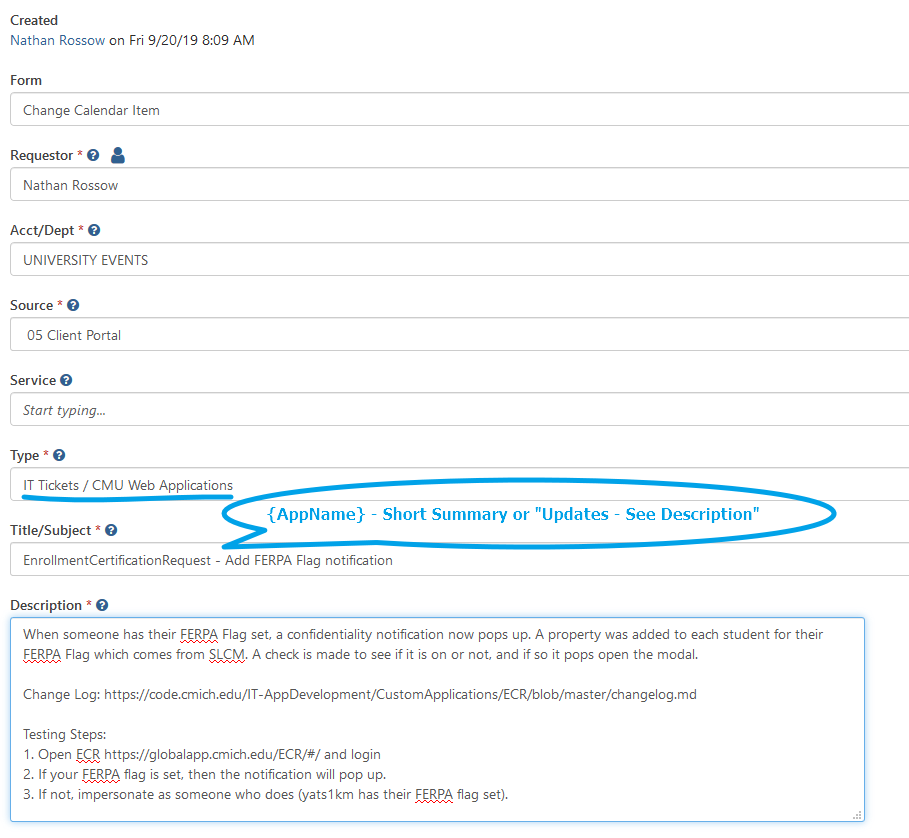

# Summary

All production deployments must follow the [CMU Change Management Policy](https://team.cmich.edu/oit/services/ServiceRelated%20Documents/OIT%20Change%20Management_ACTIVE.pdf).  The change management policy states that a change is defined as any modification to CMU production systems, planned or unplanned. In order to ensure the stability and reliability of OIT systems and services, OIT will manage changes through the three-stage process:

1. [Requesting the Change](how-to-request-a-change-calendar-deployment#requesting-the-changedeployment)
2. [Adding Change Log, Testing Steps and Maintenance Activity](how-to-request-a-change-calendar-deployment#adding-change-log-testing-steps-and-maintenance-activity)
3. [Approval of the Change](how-to-request-a-change-calendar-deployment#approval-of-the-change)
4. [Implementation of the Change](how-to-request-a-change-calendar-deployment#implementation-of-the-change)

The change management policy and change calendar were developed to increase visibility to the system changes that are occurring across OIT, which helps everyone in OIT to know when changes are being made that might have a downstream impact of which the change requester may be unaware.  TeamDynamix (TDX) helps to facilitate communication about changes since it provides a mechanism to record conversations (the ticket feed) and manage interested parties (ticket contacts).  In addtion, TDX maintains an accountability record of changes that have occurred or will occur since it records who requested and approved the original work, who are requesting and performing the work to make the change, when the change did or will occur, and who approved the change.

## Requesting the Change/Deployment

The "change" in the context of change management refers to the change of the production system, and CMU's change management policy requires authorization to make production changes at a scheduled time.  We use TDX change tickets to request and grant authorization.  

In general, the process requires that the change requester create a change ticket, which is put into a workflow.  First, the "release manager" will verify that the change request is given an appropriate impact and urgency, and that it includes enough information to adequately explain the nature of the change.  Next, the change will be flowed into the queue for final approval, which, depending on the ticket properties, will require approval by the Change Review Board (CRB) or the requester's director, or will be auto-approved.

SharePoint changes involve a little extra overhead since only the Application Support team can deploy them.  Since the development team cannot deploy into SharePoint staging or production environments, SharePoint changes are deployed subject to the App Support team's availability, which breaks the normal workflow.  In this instance, the developer will not trigger the TDX approval workflow, but instead should notify the release manager that the deployment is ready for verification in staging.  At that point, the ticket will be verified and transferred to the App Support team to trigger the workflow.

**Note for Student Developers**: Students can create the Change calendar ticket and fill it out, but will need to [connect with a full-time staff member to do the actual deployment](Student-Expectations#prod-changes)

### General Guidelines

One of the goals of the change management process is to increase visibility into all changes across OIT.  As well as representing the request for authorization to make a change, the change ticket also represents an executive summary of the nature of the change:
- The ticket title should provide enough information for potentially interested parties to know whether they should look further (i.e. read the description)
- The ticket description should provide enough information to let interested parties know whether to ask any questions
  - The description should describe what is changing (e.g., deploy new code, update JavaScript/CSS/HTML, update data or database schema), but should not be a complete rundown of every minor code change that was made
  - The description should also answer any questions in anticipation of them being asked (Does this impact CRM? Is there any related SAP change? What efforts need to be coordinated?)
- The maintenance activity is created to work around some technical limitations of TDX, and it represents the requested change window
  - Tickets only have start and end dates, but a change window occurs between start and end times
  - The maintenance activity allows us to build a calendar view to see when changes are occurring amidst all other changes
- Remember, a change ticket is visible as soon as it's created, even if it's still a work in progress
- [All Admissions changes REQUIRE a CRM DBA to confirm](how-to-request-a-change-calendar-deployment#-changes-that-affect-admissions-and-crm) it will have no surprise side effects.

The change management process also seeks to facilitate communication about changing systems and the impact of those changes on other systems.  Therefore:
- Conversations about the change should be recorded on the ticket itself
- Any interested parties should be added as contacts to make it easier to keep them updated

Ultimately, change tickets are a record not only of what changes occurred and when, but when used to facilitate communication. They also maintain a record of the information that isn't readily apparent otherwise and can answer the following questions:
- What concerns were raised about the change?  What reassurances were given before going ahead with the change?
- What external applications, processes, and systems<super>‡</super> could have been affected?  Which ones actually were affected?  Who felt the impact?
- What was the result of the change?  How many attempts did it take?
- What metrics were established to ensure correctness after the change was in place (i.e. testing steps)?  Did they indicate success?  How many attempts did it take?

#### <super>‡</super> Changes that Affect Admissions and CRM (Only Applies to Some Change Tickets)
- Changes that *might* affect CRM and Admissions, such as changes to [Apply](https://code.cmich.edu/IT-AppDevelopment/CustomApplications/Admissions) need to be tagged `admissions-change`
   
   

-  A task needs to be added to the Change ticket for review by Mike Rohn (rohn1me) [Alternatives are Jim Streng or Andrew Wittbrodt]. He will verify that the changes will not have an adverse effect on CRM (Customer Relationship Management for prospective students).

   

- This task can be done by the Release Manager or the developer doing the change.

### Examples 
    
The ticket title should give a very brief summary:
- "Degree Progress - Updates/Fixes - See Description"
- If context can be included, include it: "Course Search & Registration - Fix Logic for Financial Aid Impact Notification"

The ticket description should give a brief rundown of what changed and why:
- "The application's logic has been updated to look for a specific message being returned from SAP when a student is attempting to drop courses. If the message is present, the application will prompt the student to acknowledge that their action may have an adverse impact on their financial aid situation."
- "Update database stored procedure to return actual last name instead of 'legacy' last name."
- "One update and one change:
  - Set more restrictive filter for setting global campus transfer status (student must be a freshman)
  - Require Criminal History and Disciplinary questions on admin form (were not previously required)"

The maintenance activity title should be the same as or similar to the ticket title:
- "Deploy Degree Progress Updates/Fixes"
- "Publish Course Search & Registration Fix"

### **Incident and Service Request** Ticket Production Deployments
1. From the "Actions" dropdown of the Incident/Service Request ticket, select "Create Parent".  

2. Select the "Change Calendar Item." 
 
3. Enter the required information:
    - Requestor = yourself the developer, since you are requesting authorization to make the change
    - Responsible = the person who is facilitating the change (usually the requestor)
        - **Note**: For SharePoint deployments, this will initially be the requestor since the requestor is responsible for preparing the deployment. Responsibility is to be transferred to the App Support team once the change log is updated, testing steps are documented, and all files needed for deployment are ready to go to staging (WSP file placed on stage server ToBeDeployed folder), and instructions are clearly laid out for the Apps Team as to where to find and place any CSS/JS files in the CDN. If all of these steps were taken care of before submitting the change ticket, then you can just set the App Support team as responsible. If doing so, make sure the "Notify" box is checked, and also set the Status to *Expectations Not Set* so that it bubbles to the top of their queue. 
    - Type = **IT Ticket / CMU Web Application**  

    - Team performing change = **App Dev (Whitmore)**  

    - Start Date and Due Date should be the same (usually a **Thursday**)  

## Adding Change Log, Testing Steps, Readme, and Maintenance Activity
1. Confirm that you have updated the ChangeLog.md in Gitlab in the master branch of this application.  See [How to keep a change log](https://code.cmich.edu/IT-AppDevelopment/Documentation/wiki/-/wikis/how-to-keep-a-change-log) for specific formatting.
   - Edit the Description and add a link to the changelog.md like `Change Log: https://code.cmich.edu/IT-AppDevelopment/CustomApplications/CourseSearchRegistration/blob/master/CHANGELOG.md`
   - Under **Current Activities** > **Update CHANGELOG** > Click "Mark Complete"
1. Edit the Description so that the bottom contains `Testing Steps: {explain how to test here}`
1. Under **Current Activities** > **Document Testing Steps** > Click "Mark Complete"
1. Confirm that you have an updated the README.md in Gitlab in the master branch of this application. Make sure it meet [README Requirements](https://code.cmich.edu/IT-AppDevelopment/Documentation/wiki/-/wikis/how-to-setup-a-project-readme#required) and explains any new notes that will help the application be well maintained in the future.
1. Under **Current Activities** > **Review/Update README** > Click "Mark Complete"
1. For **non-SharePoint** changes, add a Maintenance Activity.  In SharePoint deployments, the App Support team will create the maintenance activity once the ticket is assigned to them.

     

    - The Title should be like this example, "Publish LMSConnect Updates"

    

1. Trigger the workflow to start:
   - For **non-SharePoint** changes, under **Current Activities** > **Send to CRB** > Click "Mark Complete"
   - For SharePoint changes, see the next section. (Do not send to CRB. The App Support team will do this)
  
## SharePoint Change
SharePoint changes require additional information.  
 - Go ahead and Submit the change ticket...
 - Open the ticket you just submitted and select "Update" to complete the SharePoint deployment response template:

In general, the ticket should not contain any more information than what is necessary for App Support to make the change and verify it:

- If other files must be deployed with the WSP file, they should be indicated; but if those files "can" be deployed independently, then a separate maintenance activity should be created for an independent deployment. For example, if a CDN file (JS or CSS) supplements the deployment of the WSP, but is not critical to its deployment. Otherwise, make sure to give the paths to the file locations on the staging CDN, which at the time of this writing supplies both betaweb and stgweb servers.
- When files need to be copied, include the source and destination
- Include the information necessary for the person deploying to know that it was deployed correctly (screen shots can be helpful, as well as testing steps)
- The above should all be worked out between the developer and the App Support team member who is to deploy to production prior to the time of release to avoid any unpleasant surprises.

## Standard and Routine
Certain types of frequently made changes are so low risk and procedural in nature (e.g., non-logic database changes or configuration changes) are identified as **Standard and Routine** changes. These changes are pre-approved by the CRB and auto-approved after the ticket is sent to CRB in TeamDynamix. They include things like "Non-logic Database changes" and "Configuration Changes". This is explained further on the public [KB Article 35842](https://cmich.teamdynamix.com/TDClient/664/Portal/KB/ArticleDet?ID=36523).
 
- Change Log: On Standard and Routine Change Calendar ticket a Change Log is **not** required, but should be added when it makes sense, such as when significant config changes that impact users
- Testing Steps: Should be included on Standard and Routine, even if they are a SQL Select to prove a record has been changed or deleted, or that the config change had the desired affect
- Maintenance Activity: Should be included on Standard and Routine, giving the time frame the change will be made on a production system

## Approval of the Change
Reference the [CRB graphic](https://cmich.teamdynamix.com/TDClient/KB/ArticleDet?ID=35842) on "Impact and Risk (aka technical complexity)" to know what type of ticket to use.
- All Non-"Standard and Routine" Changes need approval by release manager (*Nathan Fortier*) and your director (*Eric Whitmore*). For **Director-Approved** changes this is all that is needed. You will get notified via email of approval or denial.
- For the **CRB (Change Review Board) Approved** changes final approval comes from *Roger Rehm*. You will get notified via email of approval or denial.

## Approval Deadlines
- For **Change Review Board (CRB) approved** releases (based on *impact* and *risk*), the deadline is 1:30pm Monday
- For **Director approved** releases (based on *impact* and *risk*), the deadline is 1:30pm Wednesday
- For Change Calendar ticket that come in after the deadline, expect that they will be looked at the following week
- When in doubt, or for changes outside the regular deployment window, be sure to direct message Eric Whitmore and Nate Fortier.
- ***Note***: It is the *developer's job* to communicate with the end-user office that 1:30pm on Monday or Wednesday is the deadline, as your Director needs time to review and approve each weeks changes. They can contact your Director (Eric Whitmore) directly if they have more questions. 
In the *rare* case that there is a time sensitive reason the change must deploy this week, you can get the change request built, and wait until a later time in the day for the ultimate **go/no go** sign off from them.

## Implementation of the Change
1. Come in to work during the deployment window (4am to 7am) and follow all the necessary steps to complete the deployment
2. Upon successful completion 
   1. On the Maintenance Activity, click **Mark Complete**
   2. On the Change Calendar ticket, update the Status from **TBD** to **Yes** or **No, ...**

        

      - If "**No, ...** it was not successful, notify your director (*Eric Whitmore*) through an update on the ticket and a message in *Teams* of the problems encountered during deployment and if you cancelled, rescheduled, rolledback, or eventually fixed it outside the change window
      - If "**Yes**" send an update on the ticket, 
   3. If there are no further verification steps by the business office, mark the Change Calendar ticket as **Resolved**, often with cascade, to notify all interested parties that the change was successful.

## Tags
[[TeamDynamix]](https://code.cmich.edu/search?project_id=365&repository_ref=master&scope=wiki_blobs&search=TeamDynamixTag)
[[Deployment]](https://code.cmich.edu/search?project_id=365&repository_ref=master&scope=wiki_blobs&search=DeploymentTag)